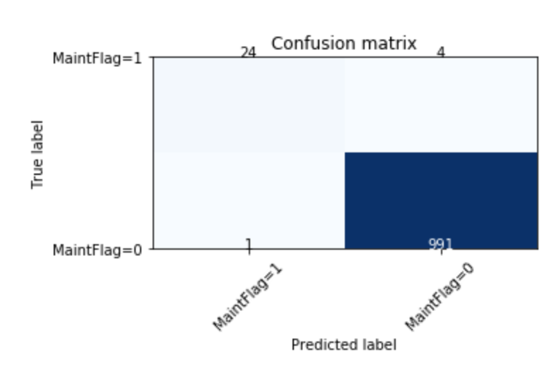

# Defining the anomaly detection scoring model 

Predictive maintenance and anomaly detection are complex problems to address. We do not pretend to address those complex problems in this repository, as we focus in putting in place the end to end creation and deployment of the model. To review the problem of predictive maintenance read [this article.](predictive-maintenance.md)

*If you want to contribute to build a better model, we are looking for contributors*.

To build the model and work on the data, we will use a local version of **Jupyter** notebook to load the logistic regression nodebook from the `ml` folder. 

We have two types of notebook

1. Start a jupyter server using our docker image and a postgresql in IBM cloud.

    ```
    pwd

    ./startJupyterServer IBMCLOUD  or LOCAL
    ```

1. Then open a web browser to `http://localhost:8888?token=<sometoken>` go under `work/ml` folder.
1. Open one of the model:
    * the `model_logistic_regression.ipynb` to work on data set saved in the `ml/data/telemetries.csv` file. 
    * the `model_logistic_regression-pg.ipynb` to work on data saved in postgresql running on IBM Cloud.
    
    The notebooks include comments to explain how the model is done. We use logistic regression to build a binary classification (maintenance required or not), as the data are simulated, and the focus is not in the model building, but more on the end to end process.

    The notebook persists the trained model as a pickle file so it can be loaded by a python module or another notebook.

    For more information on using the Jupyter notebook, here is a [product documentation](https://jupyter-docker-stacks.readthedocs.io/en/latest/index.html).

    * The co2 sensor plot over time shows the training data with some sporadic behavior:

    

    * The confusion matrix shows very little false positive and false negative:

    

1. Use the model in another notebook: We can use a second notebook to test the model with one telemetry record using the pickle serialized model. The notebook is named `predictMaintenance.ipynb`.