# Watson Studio: developing the predictive model

Cloud Pak for data integrates [Watson Studio](https://www.ibm.com/cloud/watson-studio) to develop manchine learning models and do feature engineering. In this chapter we are using two approaches to develop the model, one using [AutoAI](https://www.ibm.com/cloud/watson-studio/autoai) and one use [notebook](#notebook).

The Data Steward has prepared a dataset by joining different datasources, but he did not pay attention to the column semantic for building a machine learning. So the Data Scientist will start to review and adapt the data.

## Data analysis and refinery

The data scientist wants to do at least two things on the current data set: remove unnecessary features (the longitude and lattitude will not have any value to assess the sensor anomaly), and transform the problem to be a classification problem by adding a label column. 

Note that we could have model the problem using unsupervised learning and identify anomaly with clustering or anomaly detection. This will be done in the future to present a more realistic approach to this classical industrial problem.

For that, we use the `Data Refinery` capability of Cloud Pak for Data:

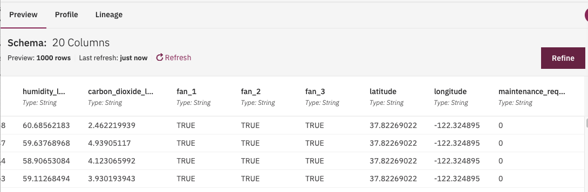

and then clean and shape the data to prepare for the model. For example remove columns like latitude, longitude, timestamp, _id, telemetry_id:

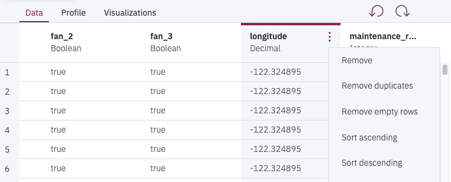

To define a new column to be used as label, we use the `Operation` tab to add `Conditional replace` to apply some basic logic on the sensor columns by using two thresholds: test the value of the O2 to be less then a threshold (11) with a second condition on the CO2 to be greater than another threshold (12):

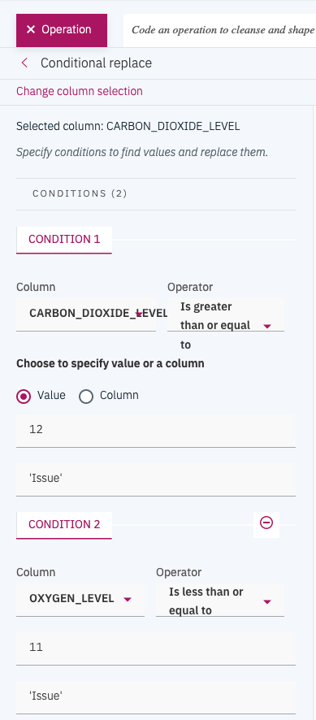

We add the new label (Issue, NoIssue) in the Anomaly Flag column:

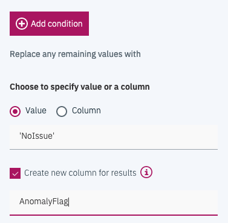

Which translates to something like: "Replaced values for AnomalyFlag: CARBON_DIOXIDE_LEVEL where value is greater than 12 as 'Issue', OXYGEN_LEVEL where value is less than 12 as 'Issue'. Replaced all remaining values with 'NoIssue'."

Once the label column is added, and any new derived data are added, we can start a `refinery job`, that will create a new dataset in our project:

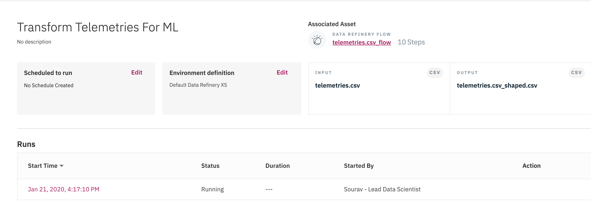

## AutoAI

AutoAI uses data to automatically select the best supervised algorithm to determine the best classification or regression models with optimized hyper parameters.

Within a project, we can add an `Auto AI Experiment`:

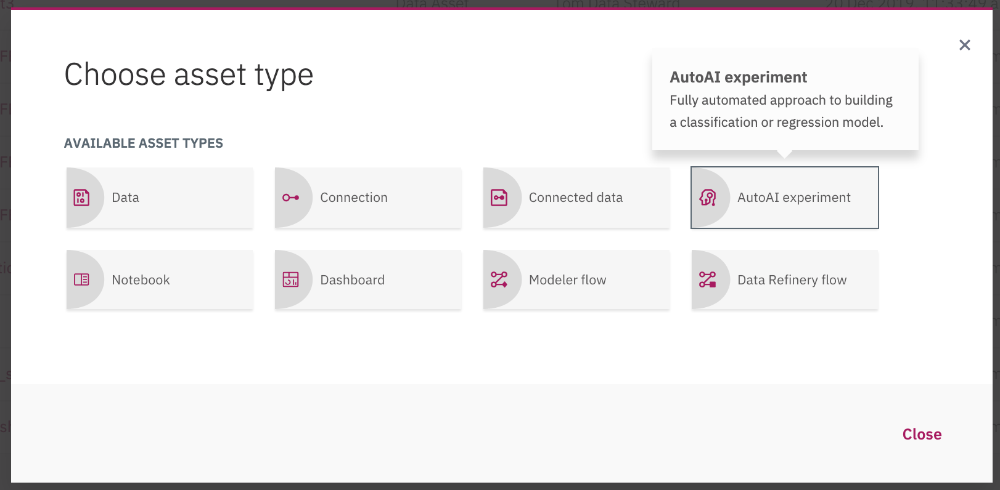

Then specify a name and server configuration:

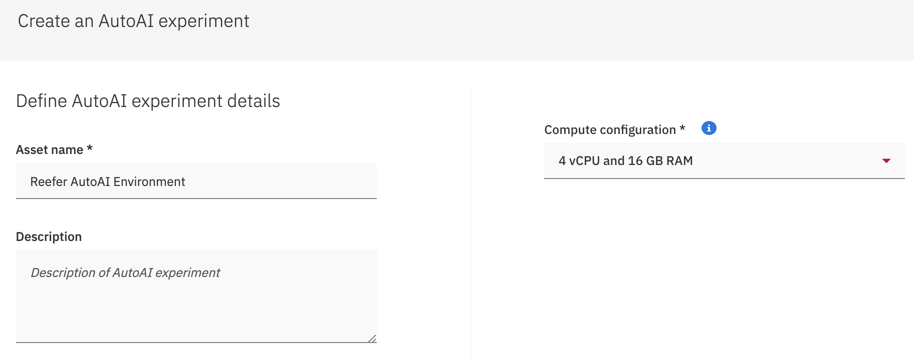

Add a existing data source (the one prepared by the refinery job), and then specify the column to use for prediction (AnomalyFlag column):

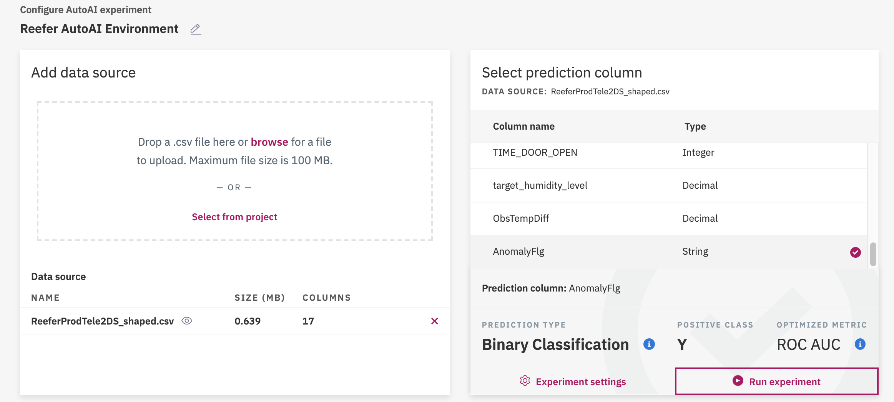

Then execute the prediction experiment.

AutoAI will do different steps, split the data, prepare data, and then select model or algorithm that may better address the problem. For classification model, it will select among 30 potential candidates: decision tree, random forest, LGBM, XGBoost... Each algorithm selection will generate a pipeline which will be scored to present the most accurate one:

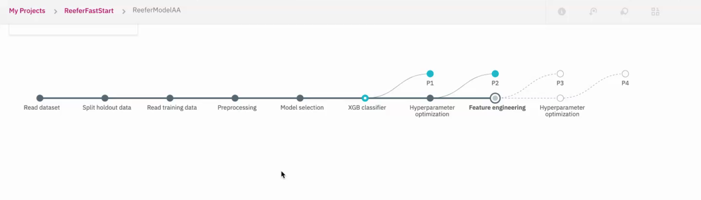

The resulting experiments are ranked.

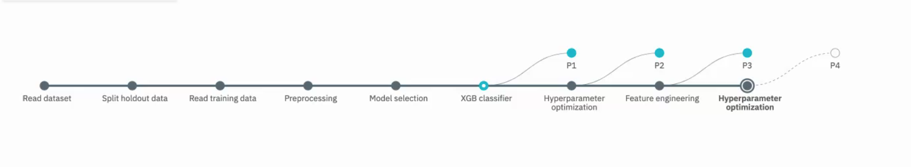

When models or pipelines are created, we can see the details of each model, to see how they performed.

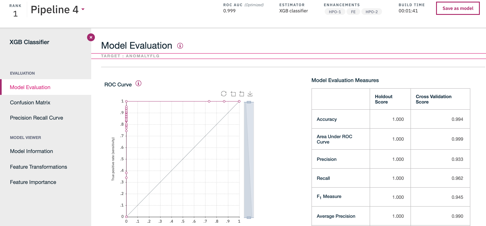

The confusion matrix for the experiment ranked #1:

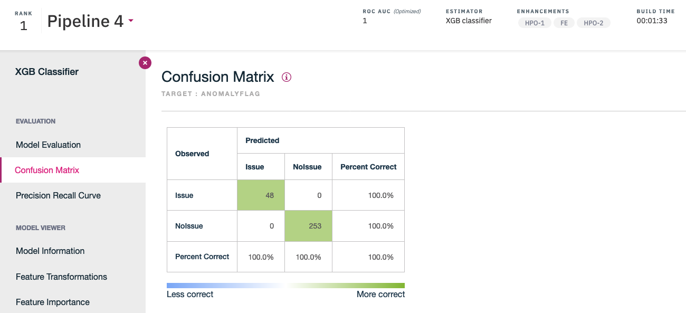

The tool offers nice capabilities like the feature transformation:

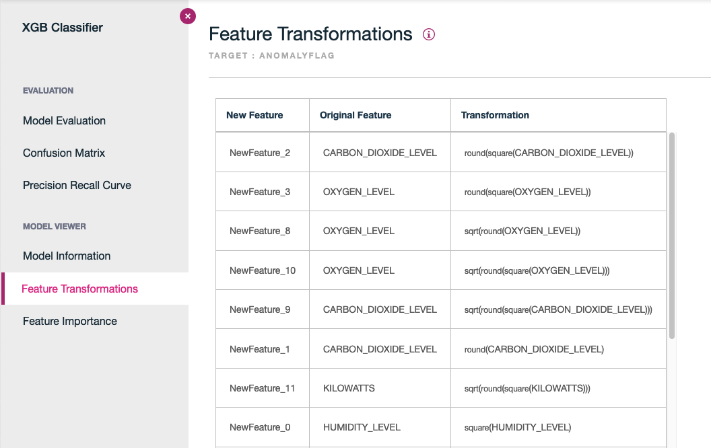

And the feature importance ranking, which helps to assess what are the features that impact the classification.

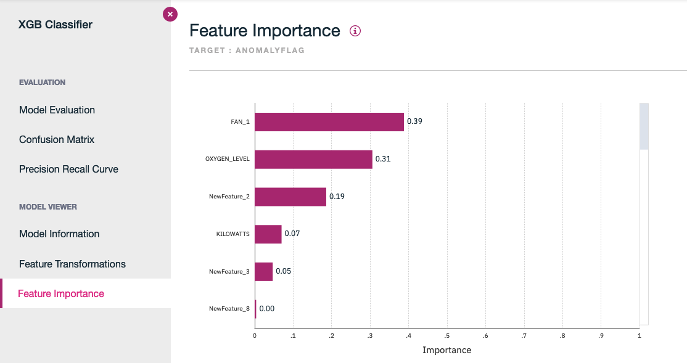

Once the model is saved, it can be added to a Catalog, and then being deployed.

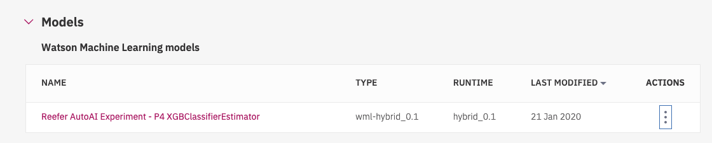

### Model Deployment

Once a model is created is promoted to a "space".

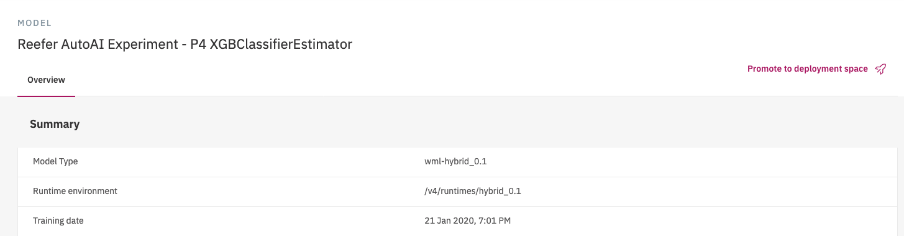

A **space** contains an overview of deployment status, the deployable assets, associated input and output data, and the associated environments.

To access the deployment space, use the main left menu under `Analyze -> Analytics deployment spaces`.

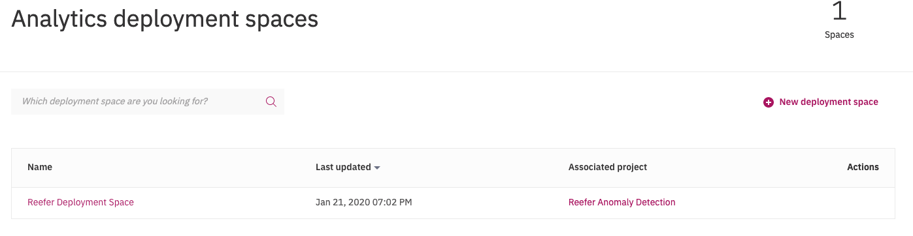

And under a given space we can see the assets and deployments in this space:

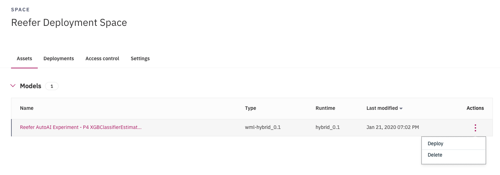

On the Assets page, you can view the assets in the deployment space (Here we have our AutoAI experimental model deployed). You can see how many deployments each asset has and whether the asset is configured for performance monitoring. The following figure displays the deployed model

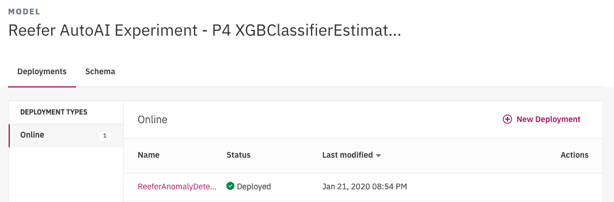

And going into the deployed model view, we can see the API end point:

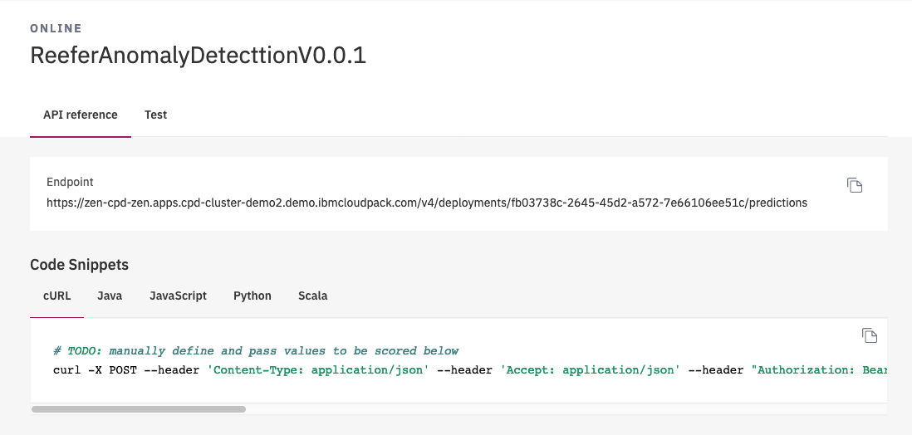

And even test the prediction from the user interface.

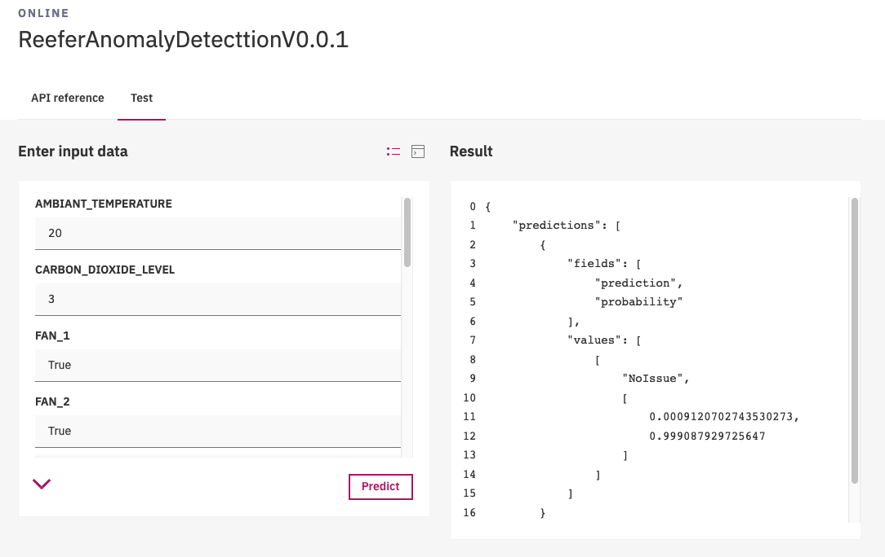

A next step is to infuse this model into the scoring application...

## Notebook

In this section, we are developing a notebook on the telemetries dataset. We have already a project, and defined a data set from [the data collection step](../collect/cp4d-collect-data.md), so we need to add a notebook. For that, in the project view, use `Add to project` ...

and select the Notebook, 

specify a name and select python 3.6 runtime...

Add a cell to access pandas, and maplablib in the first cell, and then get the code for accessing the dataset, by using the top right button:

To Be Continued...