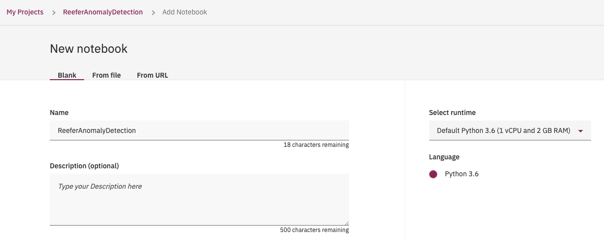

# Watson Studio: developing the predictive model

In this chapter, we are developing a notebook on the telemetries dataset. We have already a project, and defined a data set from [the data collection step](../collect/cp4d-collect-data.md).

In the project view, use `Add to project` 

and select the Notebook

Add a cell to access pandas, and maplablib in the first cell, and then get the code for accessing the dataset, by using the top right button:

