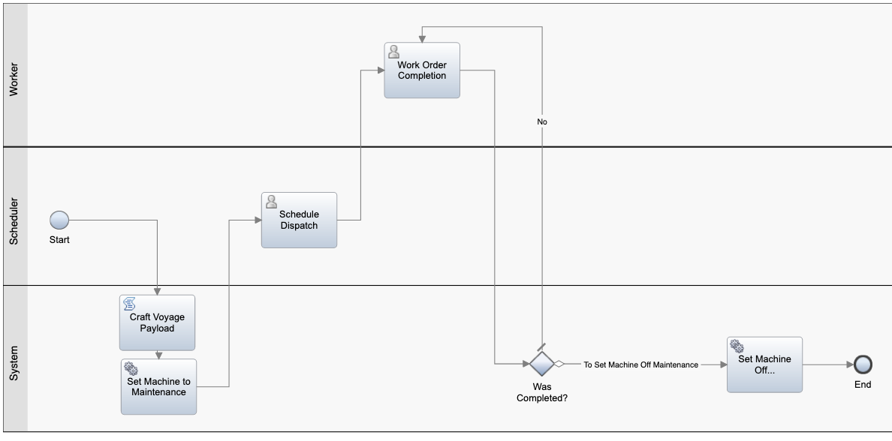

# Maintenance field engineer dispatching business process

## Problem statement

When the anomaly detection scoring service creates a maintenance record on the containers topic, the container microservice will dispatch a field engineer so that the engineer can go the reefer container if it was unloaded in the destination harbor. The process of scheduling an engineer and then completing the work can best be facilitated through a process based, structured workflow. We will be using IBM BPM on Cloud or Cloud Pak for Automation to best demonstrate the workflow.

Before creating a ticket or while adding information to the ticket, the process may get the container estimated arrival time and destination harbor to do the dispatching. This means accessing an API on container microservice.

## Business Process Model

This process demonstrates the flow of the task through the process workflow

1. Craft Voyage Payload
    * Script - This step assembles the payload for communicating to the reefer container microservice for status updates. We will craft it from the incoming payload.
2. Set Machine To Maintenance
    * Service Flow - This step creates a REST call to the reefer container to set the machine to Maintenance Mode
3. Schedule Dispatch
    * User Interface - This step gives the scheduler team an interface to look at the given maintenance request and reefer container with issues and manually assign a worker to provide physical support on it
4. Work Order Completion
    * User Interface - This step allows the worker to complete a simple form marking the request as fixed and updating comments relating to the effort
5. Was Completed?
    * Decision Gateway - This decision gateway determines whether to reassign the task to the worker to fill out on a later date (such as equipment not being available), or allows to finish the process
6. Set Machine Off Maintenance
    * Service Flow - This step initiates a REST call to process the changes, capacity, and updated information from the previous captured in the Work Order Completion step.

## Deploy TWX to BPM on Cloud

The following simple video shows you how to deploy the exported 'twx' file to BPM on Cloud. 

The same can be done on Cloud Pak for automation.

## Demo of Workflow

The following short video presents how to capture our CSRF Token for the Call to Kick off BPM/BAW

* We get the CSRF Token at first, and then find the Acronym such as via the Designer
* When we actually execute the request we need the CSRF Token, the Model, the Acronym, and the input data

------------

Here we can see the Model as the Process Name directly from Designer

* Our input data is the input variables in Name,Value pair format
* We then execute the request and get our 201 Success!

------------

In this step we open up process portal, claim, and see our Dispatch Scheduler UI.

 
* When we click "Retrieve Current Location" we query the container via ID to get updated container info if needed. This code also executes on Load.
* It is then the Scheduler's job to assign a worker, so we rely on a Worker to be selected from the dropdown

------------

We now see the Work Order Completion UI, the worker will pick up the task and work it.

* We allow for the latitude and logitude to be updated, the capacity to be modified, an audit log to capture comment history, and whether or not the work was able to be completed.
* Upon finishing we complete the Work Order and via BPM/BAW message the reefer container microservices with the new status

------------

Here we see the container updated with the value of 25 we put in as a worker

