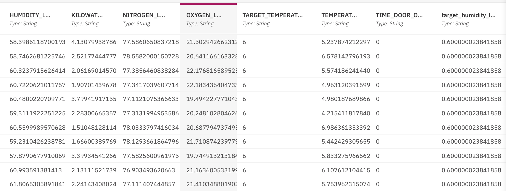

# IBM Cloud Pak for Data: data collection

To develop the anomaly predictive service we first need to access the data. We have two datasources in this example: the product information and the telemetries data coming from the different Reefer Containers. With the telemetries we should be able to assess anomaly. The Telemetries are saved to a noSQL database. We are using MongoDB on IBM Cloud.

Using [Mongo Compass](../environments/mongodb-compass.md), we can see one of telemetry document as saved into MongoDB.


**Figure 1: Mongo DB Compass: ibmcloud.telemetries collection**

It is important to note that the Json document has sensors document embedded. As we will see later they will be mapped to different tables in Cloud Pak Virtualization.

As part of the data governance capability, a user with data engineer role can do the following tasks:

* Define one to many connections to the remote different data sources
* Create virtual assets to materialize tables and views from the different data sources
* Assign an asset to an exisint project or a data request (governance object to ask to access data)

## Define connection

First we need to get the connection information for the MongoDB database. See [this note](../environments/mongo.md) for information about Mongo DB instance on IBM Cloud.


* Get the information about the data connection.


**Figure 2: Mongo DB on IBM Cloud connection information**

* Then download the TLS certificate as pem file:

```shell
ibmcloud login -a https://cloud.ibm.com -u passcode -p <somecode-you-get-from-your-login>
# Define your resource group
ibmcloud target -g gse-eda
ibmcloud cdb deployment-cacert gse-eda-mongodb > certs/mongodbca.pem
```

Back to Cloud pak for Data, an administrator may define connections as a reusable objects by entering the data sources information. The figure below illustrates the connection configuration to the Mongo DB running on IBM Cloud:


**Figure 3: Define connection in CP4D**

**Add connection in Cloud Pak for Data**

Virtualization may help automatically group tables without moving data, so we can group different data elements into a single schema.

## Create a new project

Once logged into Cloud Pak for Data, create a new project. A project is a collection of assets the analytics team work on. It can include data assets and Notebooks, RStudio files
Models, scripts...

From the main page select the project view:


**Figure 4: Top level navigation menu**

and then new project, and select `analytics`:


**Figure 5: Add project**

Select an empty project:


**Figure 6: Select project type**

Enter basic information about your project


**Figure 7: Project metadata**

The result is the access to the main project page:


**Figure 8: Project main page**

Now we need to define data assets into our project...

## Data Virtualization

As introduced in [this paragraph](https://ibm-cloud-architecture.github.io/refarch-data-ai-analytics/architecture/collect-org-data/), we want to use data virtualization to access the historical telemetry records: The data engineer uses the `Data virtualization` capability to search for existing tables and add the tables he wants in the `cart`. For that, he uses the `Virtualize` menu 


**Figure 9: Data Virtualization menu**

and then selects Mongo DB in the `Filters` column and may be apply some search on specific database name.


**Figure 10: Data Virtualization on Mongo DB**

Once done, he selects the expected tables and then use `Add to cart` link. It is important to note that we have two tables to match the telemetry json document and the sensors sub json document.

The next step is to assign them to a project:


**Figure 11: Data Virtualization cart and tables**


## Create a joined view

We need to join the telemetries and the sensors data into the same table, to flatten the records. In the current Mongo document, there is a 1 to 1 relationship between telemetry and telemetry sensor, so it is easy to flatten the model in one table.

In the Data Virtualization, as a data steward, we select `My Virtualized data`, and then 
select TELEMETRICS and TELEMETRICS_SENSORS tables, then the `Join view`. Within this new panel, we create a join key, by dragging the `TELEMETRICS_ID` and `_ID` together:


**Figure 12: Joining tables**

Once joined, a new view is created:


**Figure 13: Join view**

We see, now, those new assets as part of the project (Use `Add to project`). The figure below show this new asset in the project:


**Figure 14: Telemetries asset in the project**

With some data:

**Figure 15: Telemetry data**

!!! Note
        It is important to note that building those views will create new connection to the database engine that can be accessed by using external tool.

## Next

Next is to start working within a model [--> Next -->](../analyze/ws-ml-dev.md)