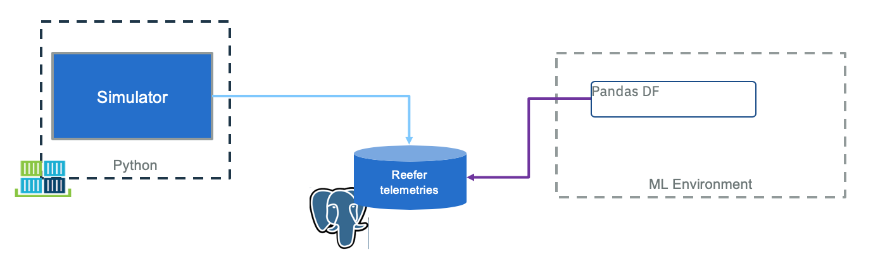
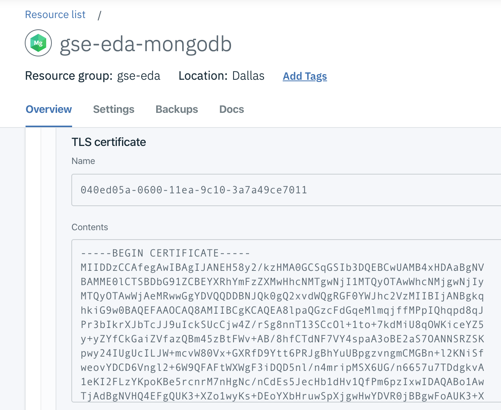

# Generate telemetry data in MongoDB

We are using the simulator to generate data. In the industry, when developing new manufactured product, the engineers do not have a lot of data so they also use a mix of real sensors with simulators to create fake but realistic data to develop and test their models.

The historical data need to represent failure, and represent the characteristics of a Reefer container. We have defined some sensors to get interesting correlated or independant features.

As of now our telemetry event structure can be seen in this [avro schema](https://github.com/ibm-cloud-architecture/refarch-reefer-ml/tree/master/data_schema/reefer_telemetry_value.avsc).

For the machine learning environment we can use csv file or mongodb database or kafka topic as data source.  The data generation environment looks like in the figure below:


**Figure 1: Data collection Simulation**

The simulator can run as a standalone tool (1) to create training and test data to be saved in a remote mongodb database or can be used to save to csv file. when it runs to simulate reefer container telemetry generation (2), it creates events to Kafka topic, and a stream application can save telemetry records to mongodb too.

We use [mongodb as a service](https://cloud.ibm.com/catalog?category=databases) on IBM cloud.


**IBM Cloud Database**

## Isolated python environment

If not done yet, you can use our docker image to get an isolated python environment. For that do the following preparation steps:

```shell
# From refarch_reefer_ml folder
cd docker
docker build -t ibmcase/python -f docker-python-tools.yaml .
docker images | grep ibmcase
# .... results should include
ibmcase/python                                  latest                 a89153c0e14f
```

The dockerfile installed the needed dependencies and use pipenv. Also we preset the PYTHONPATH environment variable to `/home` to specify where python should find the application specifics modules.

## Generate data as csv file

### Start the python environment

From the docker image created before, use the provided script as:

```shell
# From refarch_reefer_ml folder
./startPythonEnv.sh
```

### Generate power off metrics

When a reefer container loses power, restart and reloose it, it may become an issue. This is the goal of this simulation.

The simulator accepts different arguments as specified below:

```shell
usage reefer_simulator-tool
     --stype [poweroff | co2sensor | o2sensor | normal]
    --cid [C01 | C02 | C03 | C04 | C05]
    --product_id [ P01 | P02 | P03 | P04 | P05 ]
    --records <the number of records to generate>
    --file <the filename to create>
    --append | --db
```

* The `cid` is for the container id. As the simulator is taking some data from internal datasource you can use only one of those values: `[C01 | C02 | C03 | C04 | C05]`
* `product_id` is also one of the value `[ P01 | P02 | P03 | P04 | P05]`, as the simulator will derive the target temperature and humidity level from its internal datasource:
    ('P01','Carrots',1,4,0.4),
    ('P02','Banana',2,6,0.6),
    ('P03','Salad',1,4,0.4),
    ('P04','Avocado',2,6,0.4),
    ('P05','Tomato',1,6,0.4);
* `--db` is when you want to save the telemetry into mongodb DB. In this case be sure to have set the credentials and URL in the `scripts/setenv.sh` script (see the `scripts/setenv-tmp.sh` template file)
* `--file` is to specify a csv file to write the data
* `--append` is used to append the output of this run to an existing file: It permits to accumulate different simulation in the same dataset.

* (Re)create a new file. It is an important step to get the column names as first row.

```shell
python simulator/reefer_simulator_tool.py --stype poweroff --cid C01 --records 1000 --product_id P02 --file telemetries.csv
```

* then new records are added by appending to existing file

```shell
python simulator/reefer_simulator_tool.py --cid C03 --product_id P03 --records 1000 --file telemetries.csv --stype poweroff --append
```

The results looks like:

```shell
    Generating  1000  poweroff metrics

    Timestamp   ID  Temperature(celsius) Target_Temperature(celsius)      Power  PowerConsumption ContentType  O2 CO2  Time_Door_Open Maintenance_Required Defrost_Cycle
    1.000000  2019-06-30 T15:43 Z  101              3.416766                           4  17.698034          6.662044           1  11   1        8.735273                    0             6
    1.001001  2019-06-30 T15:43 Z  101              4.973630                           4   3.701072          8.457314           1  13   3        5.699655                    0             6
    1.002002  2019-06-30 T15:43 Z  101              1.299275                           4   7.629094
```

From the two previous commands you should have 2001 rows (one for the header which will be used in the model creation):

```shell
wc -l telemetries.csv
2001 telemetries.csv
```

### Generate Co2 sensor malfunction in same file

In the same way as above the simulator can generate data for Co2 sensor malfunction using the command:

```shell
python simulator/reefer_simulator_tool.py --cid C03 --product_id P02 --records 1000 --file basedata --stype co2sensor --append
```

### Generate O2 sensor malfunction in same file

```shell
python simulator/reefer_simulator_tool.py --cid C03 --product_id P02 --records 1000 --file basedata --stype o2sensor --append
```

## Saving to Mongodb

MongoDB is a popular document-based database that allows developers to quickly build projects without worrying about schema. Mongo components include:

* mongod - the core process that runs the actual database
* mongos - controls routing to the databases in case of sharding
* config servers (CSRS) - stores the metadata in a sharded environment.

We propose to persist telemetry for a long time period. For example we can configure Kafka topic to persist telemetries over a period of 20 days, but have another component to continuously move events as JSON documents inside Mongodb.

### Using Mongodb as service on IBM Cloud

Create the MongoDB service on IBM cloud using default configuration and add a service credentials to get the mongodb.composed url: (something starting as `mongodb://ibm_cloud_e154ff52_ed`) username and password.

Set those environment variables in `scripts/setenv.sh` the `export MONGO_DB_URL="mongodb://ibm_c..."`

Get the TLS certificate as pem file:

```shell
ibmcloud cdb deployment-cacert gse-eda-mongodb > certs/mongodbca.pem
```

#### Start python environment

Use IBMCLOUD if you use mongodb, postgresql and kafka on cloud, or LOCAL for kafka and postgresql running via docker compose.

```shell
 ./startPythonEnv IBMCLOUD

root@03721594782f: cd /home
```

*If you are using your own environment, to access mongodb we use the pymongo driver (`pip install pymongo`)*

The code below is a simple example of how to access mongodb.

```python
 URL=os.getenv('MONGO_DB_URL')
 client = MongoClient(URL,ssl=True,ssl_ca_certs='/home/certs/mongodbca.pem')
 db = client['ibmclouddb']

 # insert a record
 result = db.telemetries.insert_one(telemetry)
 telemetry = db.telemetries.find_one({"_id": ObjectId(result.inserted_id)})

 # get all the records
 telemetries = db.telemetries.find()
 for t in telemetries:
```

See the rest of the code in [ml/data/ToMongo.py](https://github.com/ibm-cloud-architecture/refarch-reefer-ml/blob/master/ml/data/ToMongo.py) to load records from CSV file, or the [simulator/infrastructure/ReeferRepository.py](https://github.com/ibm-cloud-architecture/refarch-reefer-ml/blob/master/simulator/infrastructure/ReeferRepository.py) for the one generating metrics and uploading them directly to MongoDB.

We propose two approaches to load data to MongoDB: use created csv file, or run the simulator tool connected to MongoDB.

#### Add data from csv file

Using the `ToMongo.py` script we can load the data from the `ml/data/telemetries.csv` file to mongodb. In a Terminal window uses the following commmand:

```shell
./startPythonEnv.sh IBMCLOUD

cd ml/data

python ToMongo.py
```

#### Add data using the telemetry repository of the simulator

Verify your MONGO* environment variables are set according to your created service in the `scriptssetenv.sh` file.

```shell
./startPythonEnv.sh IBMCLOUD

cd simulation

python simulator/reefer_simulator_tool.py --cid C03 --product_id P02 --records 1000  --stype poweroff --db

python simulator/reefer_simulator_tool.py --cid C03 --product_id P02 --records 1000  --stype co2sensor --db

python simulator/reefer_simulator_tool.py --cid C03 --product_id P02 --records 1000  --stype o2sensor --db
```

#### Verify data with mongo CLI

To verify the data loaded into the database we use [mongo](https://docs.mongodb.com/manual/installation/) CLI with the following command:

```shell
# to connect
mongo -u $USERNAME -p $PASSWORD --tls --tlsCAFile mongodb.pem --authenticationDatabase admin --host replset/1a2ce8ca-<>.bn<>c0.databases.appdomain.cloud:30796 --tlsAllowInvalidCertificates
```

*The full host name is masked*. 

The USERNAME and PASSWORD are environment variables you set from the IBM Cloud service credentials. Something like:

```
{
  "connection": {
    "cli": {
      "arguments": [
        [
          "-u",
          "ibm_cloud_<>_48b1_b899",
          "-p",
          "3359192a<>e5fbdf51fd573676e58aff4f9e223",
```

The `mongodb.pem` is the certificate in text save in a file. To get this certificate you can use the following command:

```
ibmcloud cdb deployment-cacert gse-eda-mongodb > mongodb.pem
```

or by using the IBM Cloud mongodb service user interface (Manage menu):



Once connected use the ibmclouddb database with mongo CLI:

```
MongoDB server version: 4.2.0
replset:PRIMARY> use ibmclouddb
replset:PRIMARY> db.getCollection("telemetries").find()
```

### Using MongoDB on Openshift 4.2 on-premise

We assume you have provisioned an Openshift 4.2 cluster and logged in. We use the following container image: `centos/mongodb-36-centos7`. So to install it, we use the following command:

```
oc new-app -e \
    MONGODB_USER=mongo,MONGODB_PASSWORD=<password>,MONGODB_DATABASE=reeferdb,MONGODB_ADMIN_PASSWORD=<admin_password> \
    centos/mongodb-36-centos7
```

Connect to the pod and then use the mongo CLI

```shell
$ oc get pods
NAME                                         READY     STATUS             RESTARTS   AGE
mongodb-36-centos7-1-wcn7h                   1/1       Running            0          4d

$ oc rsh mongodb-36-centos7-1-wcn7h 
bash-4.2$ mongo -u $MONGODB_USER -p $MONGODB_PASSWORD $MONGODB_DATABASE
MongoDB shell version: 2.4.9
connecting to: reeferdb
> show collections
```

To remove the db on openshift: `oc delete dc`

The document saved in mongo will not be a flat record as produced by the simulator when it creates records to Kafka, but a Json document which matches the following format, where sensors are in their own object:

```json
{ "timestamp": "2019-09-04 T15:31 Z",
  "containerID": "C100",
  "product_id": "P02",
  "content_type": 2,
  "sensors": {
   "temperature": 5.49647,
   "oxygen_level" : 20.4543,
   "nitrogen_level" : 79.4046,
   "carbon_dioxide_level" : 4.42579,
   "humidity_level" : 60.3148,
   "fan_1": "True",
   "fan_2" : "True",
   "fan_3" : "True",
   "ambiant_temperature": 19.8447
  },
  "target_temperature": 6.0,
   "kilowatts": 3.44686,
   "latitude": "37.8226902168957,",
   "longitude": "-122.3248956640928",
   "time_door_open" : 0,
   "defrost_cycle": 6
}
```

First be sure to set at least the following environment variables in the `setenv.sh` file

```
MONGO_DB_URL, MONGO_SSL_PEM
```

If not done before or to ensure the mongo connection works fine, run the ReeferRepository.py tool to create the telemetries collection using the following command:

```
./startPythonEnv.sh IBMCLOUD
> python simulator/infrastructure/ReeferRepository.py
```

### Delete records in database

In mongo CLI do:

```shell
db.telemetries.deleteMany({})
```
