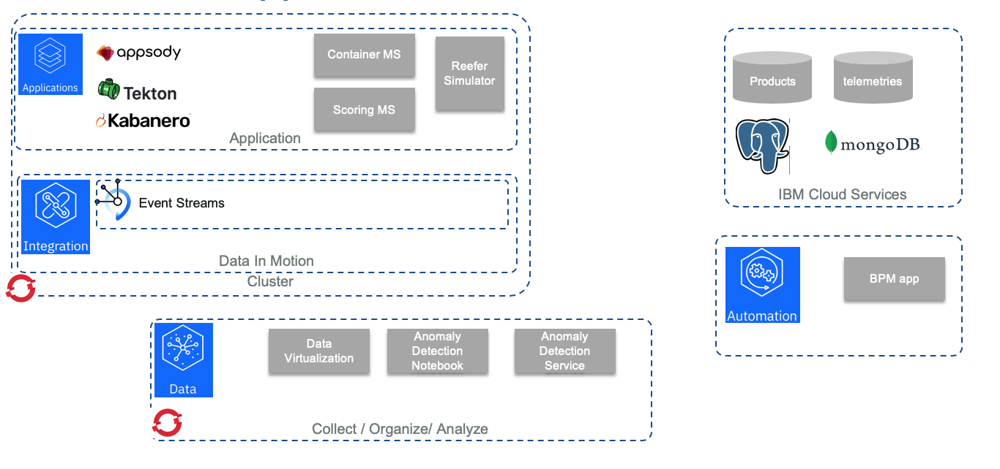
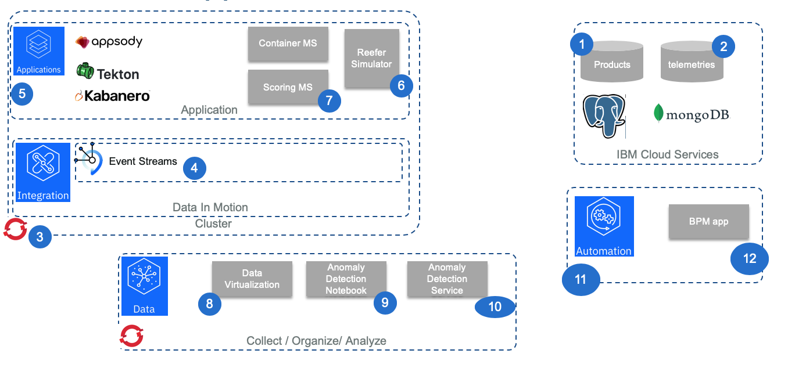
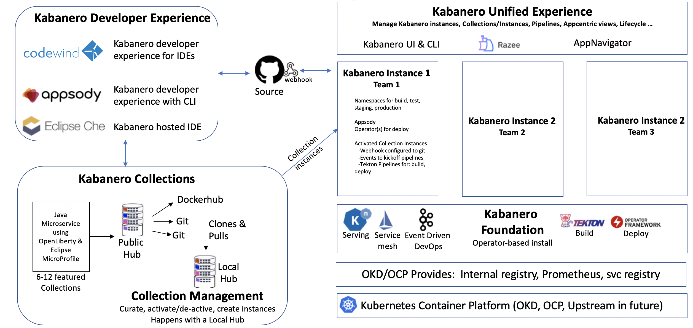
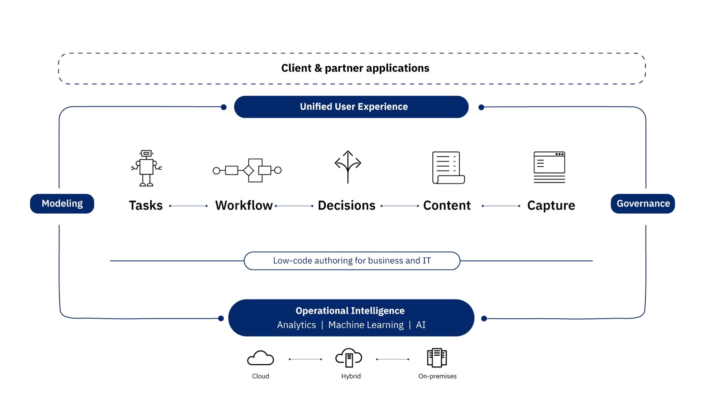

# IBM Cloud Pak Approach

The goal of this approach is to use the following IBM Cloud Paks to develop and deploy the solution.

The following diagram below, illustrates the features or components used in each cloud paks to support the implementation.

The grey components are part of the solution implementation.

* As part of **Cloud pak for Application**, we are using [Appsody](https://appsody.dev/) to generate the code and the development build, test, deploy for the Reefer simulator done in Python / Flask, and for the scoring app that is a Java Microprofile 3.0 running on Liberty server. The microprofile app is also generated using Appsody and build and deploy. As part of the CI/CD tooling, we use public github (This repository !), with Github action and [Tekton](https://tekton.dev/) for the pipeline deployment. Cloud Pak for Application is deployed on Openshift 4.2
* **Cloud Pak for Integration** is used to deploy IBM Event Streams, the IBM event backbone based on Apache Kafka. We wrote a lot of [content and best practices around Kafka](https://ibm-cloud-architecture.github.io/refarch-eda/kafka/readme/) in the Event Driven Architecture (EDA) repository. In the EDA reference implementation solution we present other CP4I assets.
* **Cloud Pak for Automation** is used to define the Field engineer dispatching process, and we deliver the process App for that.
* Finally **Cloud Pak for Data** is used to support the AI ladder: collecting and govern the data, develop the model, and publish the model as a service.

## Preparing the different environments

The numbered figure below, illustrates the step by step environment setup:

### 1- PostgreSQL Service

The products database is defined in PostgreSQL service within IBM Cloud public. To provision the environment you can read [this note](environments/postgresql.md), and then to populate the data use [this note](collect/products-postgres.md) to see how we use this service and the python code in the simulator folder or the psql tool to create the product database.

### 2- MongoDB Service

The long term persistence for the telemetry metrics we are using mongodb on IBM Cloud. This [separate note](collect/generate-telemetry.md) goes into details on how we prepare the data and upload them to mongo.

### 3- Openshift 4.2 Cluster for CP4I and CP4App

To install Openshift 4.2 cluster we recommend following Red Hat tutorials and [our cookbook](https://cloudpak8s.io/ocp/introduction/).

### 4- Deploy event streams and defines topics

We are presenting a quick overview of deploying IBM Event Streams from the Cloud Pak for Integration in [this note](environments/event-streams.md#deploying-event-streams-from-cloud-pak-for-integration) and how to configure the required Kafka topics with automation in [this note](environments/event-streams.md#create-kafka-topics-through-kubernetes-job-automation).

### 5- Deploy Cloud Pak for Application

As part of Cloud Pak for Application we are using Tekton, Appsody and the Kabanero deployment. The [architecture and development workflows](https://kabanero.io/docs/ref/general/overview/architecture-overview.html) are presented in this figure below:

The approach is to provide capabilities and extension so that lead developers or architects can define Stack and base code to reuse.

See also the reference architecture [article for application modernization](https://www.ibm.com/cloud/garage/architectures/application-modernization).

### 6- Reefer simulator as Appsody Python

We are presenting how we used the [Appsody](https://appsody.dev) Python Stack as a base to implement the Reefer Simulator, combined with other Python development best practices in [this note](infuse/simul-app.md) and we use the [CI](devops/ci.md) and [CD](devops/cd.md) practices for deployment.

### 7- Scoring microservice as Java Microprofile app

We are detailing how to leverage the Liberty profile server and MicroProfile 3.0 with the new Reactive Messaging to integrate with Kafka in [this note](infuse/dev-scoring.md).

### 8- Data Virtualization

The data management is done using [Cloud Pak for data](https://www.ibm.com/support/producthub/icpdata/) [Data Virtualization](https://www.ibm.com/support/producthub/icpdata/docs/content/SSQNUZ_current/cpd/svc/dv/dv_overview.html) capability, on a remote Mongo DB datasource. We used this approach, to illustrate how easy, it is to define virtual tables, join them to prepare a data set for machine learning work. The Telemetries are saved in a [MongoDB instance provisioned](environments/mongo.md) on the IBM Cloud.

You can read the detail in [this note](collect/cp4d-collect-data.md).

### 9- Anomaly detection notebook

[this note](analyze/ws-ml-dev.md)

### 10- Anomaly detection service

### 11- Cloud Pak for Automation

Digital business automation (DBA) allows an organization to improve its operations by streamlining the way people participate in business processes and workflows, automate repeatable decisions, and provide business users with the ability to edit and change the business logic involved in these business processes. 

The implementation of the Engineer dispatching for the maintenance of the Reefer containers is documented in [this note.](bpm/readme.md)

For more information about CP for Automation read the [Garage team's cookbook](https://cloudpak8s.io/automation/introduction/), and the ['Denim compute'](https://ibm-cloud-architecture.github.io/denim-compute/environment/rhos-install-baw/) to present a reference implementation for a Digital Business Automation solution.

### 12- Reefer Maintenance business process

The reefer maintenance process is explained in [this note](bpm/readme.md).

