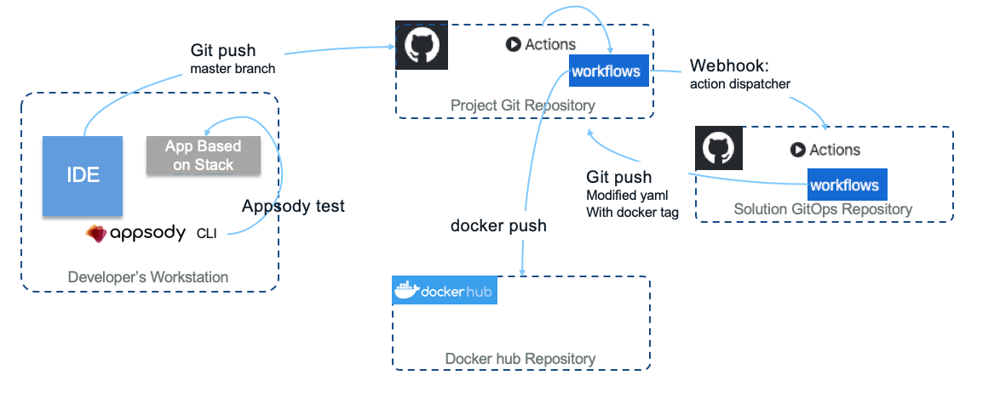
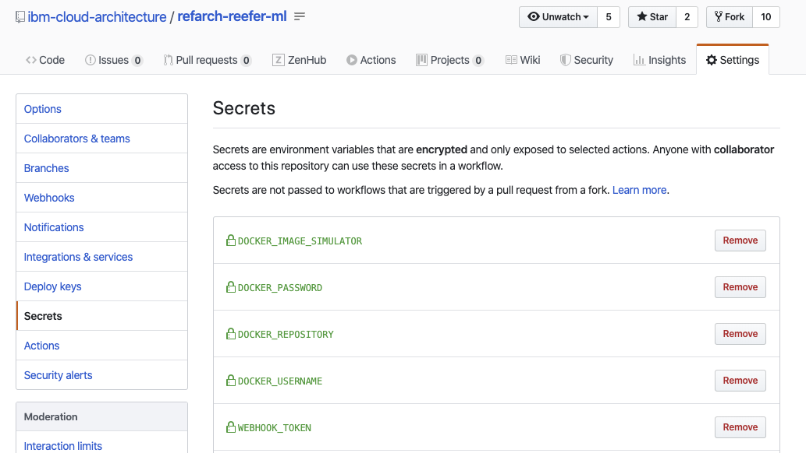
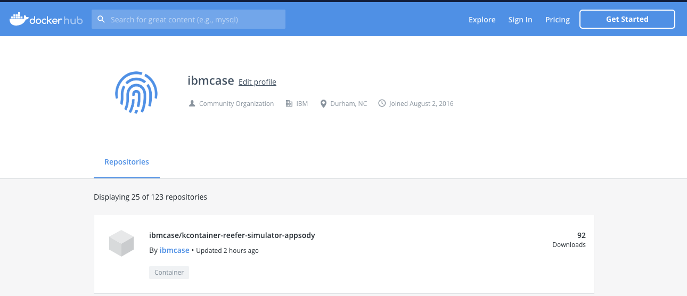

# Continuous Integration

Our Continuous Integration (CI) approach is one of _"zero-infrastructure overhead"_. As such, we utilize [GitHub Actions](https://github.com/features/actions) to build and push the microservice's associated container image to Docker Hub for public consumption.  The GitHub Actions workflows are defined in the owning repository's `.github/workflows/dockerbuild.yaml` file.

The **Reefer Simulator** microservice's CI implementation can be found via [/.github/workflows/dockerbuild.yaml](https://github.com/ibm-cloud-architecture/refarch-reefer-ml/blob/master/.github/workflows/dockerbuild.yaml) in the [refarch-reefer-ml](https://github.com/ibm-cloud-architecture/refarch-reefer-ml/) repository, while the **SpringContainerMS** microservice's CI implementation can be found via [.github/workflows/dockerbuild.yaml](https://github.com/ibm-cloud-architecture/refarch-kc-container-ms/blob/master/.github/workflows/dockerbuild.yaml) in the [refarch-kc-container-ms](https://github.com/ibm-cloud-architecture/refarch-kc-container-ms/) repository. For results of individual completed CI workflow actions, you can view the results via the **Actions** tab of a given repository.

## Overview of Continuous Integration workflows for this project

The continuous integration workflow for our project looks in the figure below, which are detailing in next sections:



On the left side, the developer uses his environment with Appsody CLI to build, and test his code, once tests run successfully, he commits and pushes the code to the master branch, then the github workflow triggers...

### 1 - Validate Docker Secrets

The first job in each GitHub Actions workflow, **[validate-docker-secrets](https://github.com/ibm-cloud-architecture/refarch-reefer-ml/blob/df754fa54f4a41b85e93a8f059977bdaccd67ddc/.github/workflows/dockerbuild.yaml#L18-L52)**, ensures that all the necessary Secrets are defined on the repository under which the build action is running. Similar to Kubernetes Secrets, [GitHub Repository Secrets](https://help.github.com/en/actions/automating-your-workflow-with-github-actions/creating-and-using-encrypted-secrets) allow you to store encrypted, sensitive information in a programmatically accessible way.

Here is an example of such secret definitions:



### 2 - Build Component Images

#### Appsody build for the Simulator microservice

The [simulator](https://github.com/ibm-cloud-architecture/refarch-reefer-ml/tree/master/simulator) microservice is built using the [Appsody](https://appsody.dev) open-source project, while leveraging the [Python Flask Appsody Stack](https://github.com/appsody/stacks/tree/master/incubator/python-flask) for its underlying framework.  The project can be easily built in a local environment by issuing the `appsody build` commands, further documented on the Appsody site under [Building and deploying](https://appsody.dev/docs/using-appsody/building-and-deploying).

The second job in the Simulator microservice workflow, **[build-simulator-image](https://github.com/ibm-cloud-architecture/refarch-reefer-ml/blob/df754fa54f4a41b85e93a8f059977bdaccd67ddc/.github/workflows/dockerbuild.yaml#L53)**, runs on a base Ubuntu container image, creates a new semantically-versioned tag _(in the form of `0.1.2`)_ for the repository, installs the latest Appsody CLI tools, performs the `appsody build` command with the [appropriate parameters](https://appsody.dev/docs/using-appsody/building-and-deploying#building-your-runtime-docker-image-with-appsody), tags the newly created version-specific image with `latest` as well, and pushes the image with both tags to the public Docker Hub repository defined by the aforementioned repository secrets.



#### Container build for the Spring Container microservice

The [SpringContainerMS](https://github.com/ibm-cloud-architecture/refarch-kc-container-ms/tree/master/SpringContainerMS) microservice is developed using the Spring Boot framework, compiled via `maven` and an associated `pom.xml` file, and packaged via a traditional Dockerfile. This project can be built locally via Maven and/or Docker, however it is recommended to consume the published container images that are a result of this continuous integration.

The second job in the [SpringContainerMS microservice github action workflow](https://github.com/ibm-cloud-architecture/refarch-kc-container-ms/blob/master/.github/workflows/dockerbuild.yaml), **[build-springcontainer-image](https://github.com/ibm-cloud-architecture/refarch-kc-container-ms/blob/f79821a3f6eeaa5b52048ef2a2aa32bdc5f58dd5/.github/workflows/dockerbuild.yaml#L48-L95)**, runs on a base Ubuntu container image, creates a new semantically-versioned tag _(in the form of `0.1.2`)_ for the repository, performs a traditional `docker build` using the [SpringContainerMS/Dockerfile](https://github.com/ibm-cloud-architecture/refarch-kc-container-ms/blob/master/SpringContainerMS/Dockerfile), tags the newly created version-specific image with `latest` as well, and pushes the image with both tags to the public Docker Hub repository defined by the aforementioned repository secrets.

### 3 - GitOps Updates

The final job, **[gitops-repo-webhook](https://github.com/ibm-cloud-architecture/refarch-kc-container-ms/blob/f79821a3f6eeaa5b52048ef2a2aa32bdc5f58dd5/.github/workflows/dockerbuild.yaml#L96-L104)**, is a linkage to our general continuous deployment process, which is GitOps-based and available via [ibm-cloud-architecture/refarch-kc-gitops](https://github.com/ibm-cloud-architecture/refarch-kc-gitops). This step performs a webhook call to our GitOps repository and notifies that repository's GitHub Actions that an update to one of its component's container images has been made and it should scan for the latest version of all the known container images and update the associated YAML files for environment updates. The repository action dispatcher triggers the git action workflow as defined [here](https://github.com/ibm-cloud-architecture/refarch-kc-gitops/blob/master/.github/workflows/update-gitops-deployments-(eda-integration).yaml) so the corresponding yaml files (appsody and helm configurations) can be updated (See [this repository](https://github.com/ibm-cloud-architecture/actions-update-gitops) to understand the action update gitops).

Here is an example of [appsody.yaml](https://github.com/ibm-cloud-architecture/refarch-kc-gitops/blob/eda-integration/gse-eda-demos.us-east.containers.appdomain.cloud/reefersimulator/appsody/app-deploy.yaml) automatically modified in the github repository:

```yaml
...
  labels:
    image.opencontainers.org/title: reefer-simulator
    stack.appsody.dev/version: 0.1.6
  name: reefer-simulator
spec:
  applicationImage: ibmcase/kcontainer-reefer-simulator-appsody:0.1.26
```

Further description of this continuous deployment process is covered in [Continuous Deployment note](cd.md).
