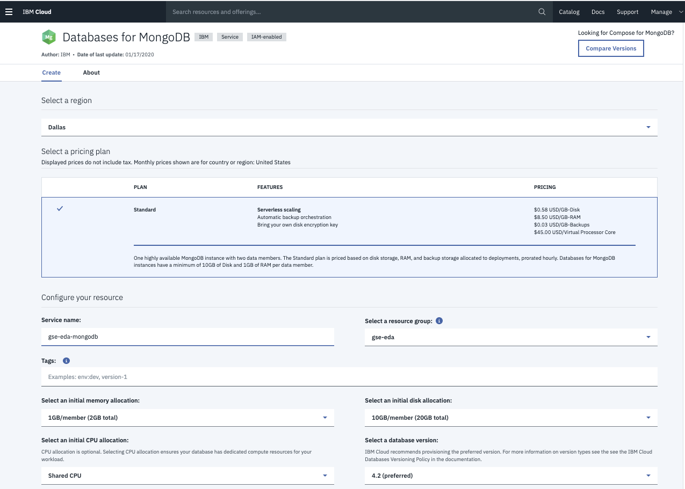
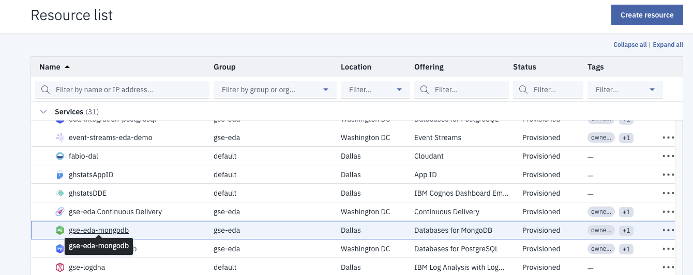
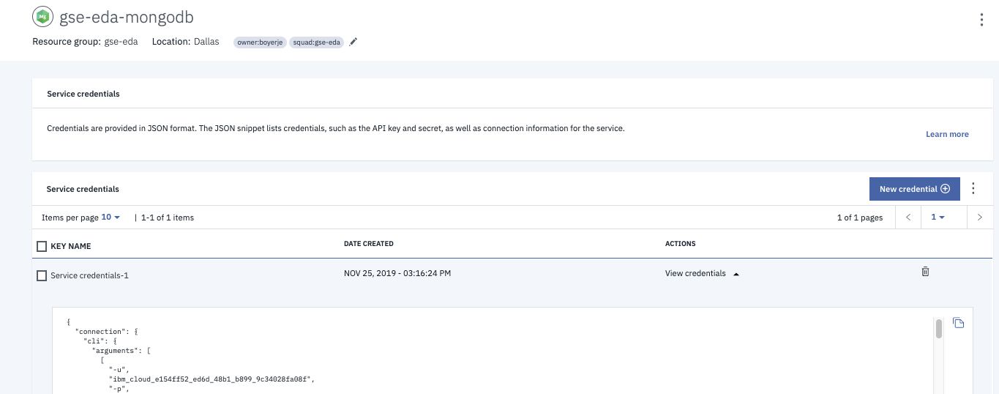

# Preparing MongoDB on IBM Cloud

* Create the MongoDB service on IBM cloud using default configuration 


**Figure 1: IBM Cloud Database**


**Figure 2: Mongo DB default configuration**

Once created the Mongo instance can be found under the services in your resource list:


**Figure 3: Mongo DB service in resource list**

* Add a `Service credentials` to get the mongodb.composed url: (something starting as mongodb://ibm_cloud_e154ff52_ed) the username and password.


**Figure 4: Mongo DB credentials**

* Get the TLS certificate as pem file:

```
ibmcloud cdb deployment-cacert gse-eda-mongodb > certs/mongodbca.pem
```

If you never used **Mongo Compass** tool to access a Mongo DB, you can get started with [this note.](mongodb-compass.md)
