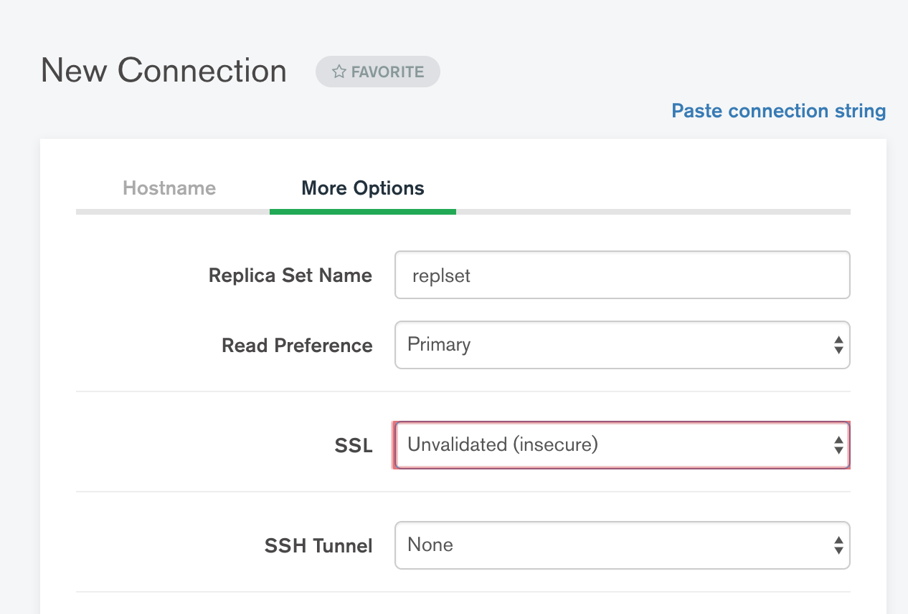
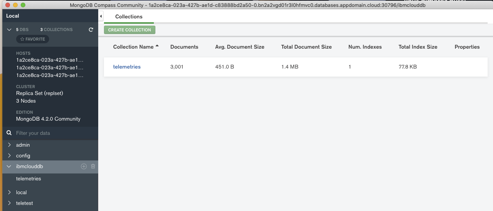

# Use MongoDB Compass user interface

First download from [MongoDB download center](https://www.mongodb.com/download-center/compass)

Once started define a new connection to the IBM Cloud mongodb instance, by using the detail view so we can access the TLS settings.

Once the connection is valid you can access the collection and browse or edit the data.

