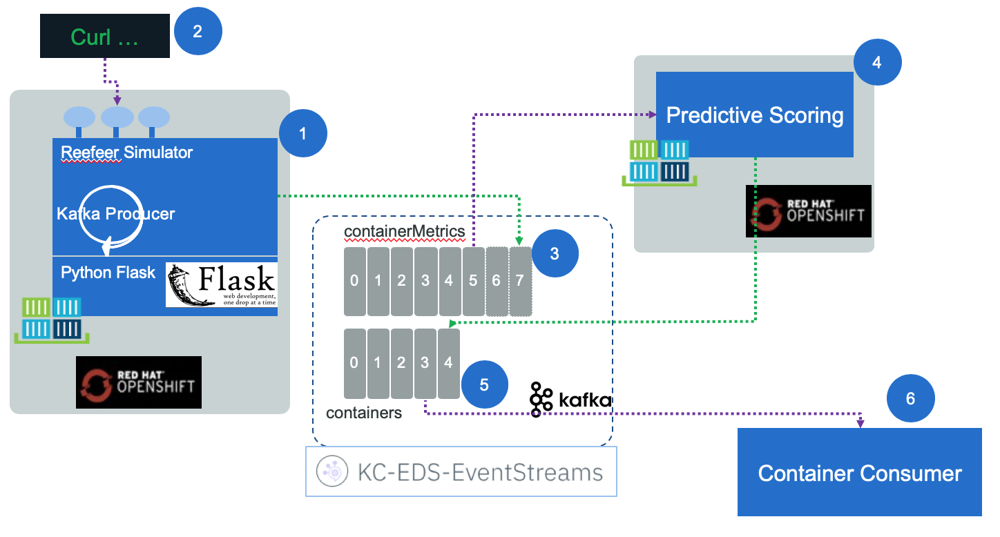
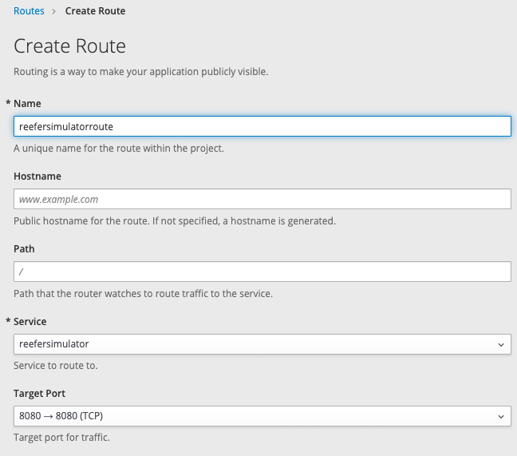

# Reefer Predictive Maintenance Solution

This project is to demonstrate how to perform real time analytics, like predictive maintenance of Reefer container in the shipping industry, using Reefer container metric event stream. 

!!! note:
        This project is part of the [reference implementation solution](https://ibm-cloud-architecture.github.io/refarch-kc/)  to demonstrate the IBM [event driven reference architecture](https://ibm-cloud-architecture.github.io/refarch-eda).

The runtime environment in production may look like in the following diagram:


The Reefer container is a IoT device, which emits container metrics every 15 minutes via the MQTT protocol. The first component receiving those messages is Apache Nifi to transform the metrics message to a kafka event. Kafka is used as the event backbone and event sourcing so microservices, deployed on openshift, can consume and publish messages.

For persistence reason, we may leverage big data type of storage like Cassandra to persist the container metrics over a longer time period. This datasource is used by the Data Scientists to do its data preparation and build training and test sets and build model.

Data scientists can run Jupyter lab on OpenShift and build a model to be deployed as python microservice, consumer of kafka Reefer metrics events. The action will be to change the state of the Reefer entity via an events to the `containers` topic. 

## Component view

While for the minimum viable demonstration the components looks like in the figure below:



1. A web app, deployed on Openshift, is running a simulator to simulate the generation of Reefer container metrics while the container is at sea or during end to end transportation. The app exposes a simple POST operation with a control object to control the simulation. Here is an example of such control.json

    ```json
    { 'containerID': 'c100',
    'simulation': 'co2sensor',
    'nb_of_records': 1000,
    'good_temperature': 4.4
    }
    ```

    See [this section to build and deploy](#the-simulator-as-webapp) the simulator web app.

1. A curl script will do the post of this json object. [See this paragraph.](#test-sending-a-simulation-control-to-the-post-api)
1. The metrics events are sent to the `containerMetrics` topic in Kafka.
1. The predictive scoring is a consumer of such events, read one event at a time and call the model internally, then sends a new event when maintenance is required. [See the note](/#the-predictive-scoring-agent) for details.
1. The maintenance requirement is an event in the `containers` topic.
1. The last element is to trace the container maintenance event, in real application, this component should trigger a business process to get human performing the maintenance. The [following repository]() is the microservice we could use on as this component, but we have a simple consumer in the `consumer` folder.

## Pre-requisites

Start by cloning this project using the command:

```
git clone https://github.com/ibm-cloud-architecture/refarch-reefer-ml
```

### Building the python environment as docker image

To avoid impacting our environment, we use a dockerfile to get the basic of python 3.7.x and other needed modules like kafka, http requests, pandas, sklearn, pytest... necessary to develop and test the different python code of this solution. To build your python image with all the needed libraries, use the following commands:

```
cd docker
docker build -f docker-python-tools -t ibmcase/python .
```

To use this python environment you can use the script: `startPythonEnv` or the following command:

```
docker run -v $(pwd):/home -ti ibmcase/python bash
```

### Be sure to have Event Stream or Kafka running somewhere

We recommend creating the Event Stream service using the [IBM Cloud catalog](https://cloud.ibm.com/catalog/services/event-streams), you can also read our [quick article](https://ibm-cloud-architecture.github.io/refarch-kc/deployments/iks/#event-streams-service-on-ibm-cloud) on this event stream cloud deployment. We also have deployed Event Stream on Openshift running on-premise servers following the product documentation [here](https://ibm.github.io/event-streams/installing/installing-openshift/). 

The following diagram illustrates the topics configured in IBM Cloud Event Stream service:


With IBM Cloud deployment use the service credentials to create new credentials to get the Kafka brokers list, the admin URL and the api key needed to authenticate the consumers or producers.

For Event Streams on Openshift deployment, click to the `connect to the cluster` button to get the broker URL and to generate the API key: select the option to generate the key for all topics.


#### Run kafka on your laptop

For development purpose, you can also run kafka, zookeeper and postgresql and the solution on your laptop. For that read [this readme](https://github.com/ibm-cloud-architecture/refarch-reefer-ml/blob/master/docker/README.md).

## Machine Learning Work

To review the problem of predictive maintenance read [this article.](predictive-maintenance.md)

### Generate data with the Reefer simulator

Well we do not have real Reefer data. But we may be able to simulate them. As this is not production work, we should be able to get the end to end story still working from a solution point of view.

The historical data need to represent failure, and represent the characteristics of a Reefer container. We can imagine it includes a lot of sensors to get interesting correlated or independant features.

We have implemented a simulator to create those metrics to be used to build the model inside Jupiter notebook and with sklearn or tensorflow library. 

#### Start python env

```
 ./startPythonEnv 

root@03721594782f: cd /home/simulator
```

From this shell, first specify where python should find the new modules, by setting the environment variable PYTHONPATH:

```
root@03721594782f:/# export PYTHONPATH=/home
```

#### Generate power off metrics

When the reefer containers lose power at some time, the temperature within the container starts raising.

The simulator accepts different arguments: 

```
usage reefer_simulator-tool --stype [poweroff | co2sensor | atsea]
	 --cid <container ID>
	 --records <the number of records to generate>
	 --temp <expected temperature for the goods>
	 --file <the filename to create (without .csv)>
	 --append [yes | no]  (reuse the data file)
```
 
```
    root@03721594782f: python reefer_simulator_tool.py --stype poweroff --cid 101 --records 1000 --temp 4 --file ../ml/data/metrics.csv --append no
```

The results looks like:
```
    Generating  1000  poweroff metrics

    Timestamp   ID  Temperature(celsius) Target_Temperature(celsius)      Power  PowerConsumption ContentType  O2 CO2  Time_Door_Open Maintenance_Required Defrost_Cycle
    1.000000  2019-06-30 T15:43 Z  101              3.416766                           4  17.698034          6.662044           1  11   1        8.735273                    0             6
    1.001001  2019-06-30 T15:43 Z  101              4.973630                           4   3.701072          8.457314           1  13   3        5.699655                    0             6
    1.002002  2019-06-30 T15:43 Z  101              1.299275                           4   7.629094 
```     

#### Generate Co2 sensor malfunction in same file

In the same way as above the simulator can generate data for Co2 sensor malfunction using the command:

```
python reefer_simulator_tool.py --stype co2sensor --cid 101 --records 1000 --temp 4 --file ../ml/data/metrics.csv --append yes
```

!!! note
        The simulator is integrated in the event producer to send real time events to kafka, as if the Reefer container was loaded with fresh goods and is travelling oversea. A consumer code can call the predictive model to assess if maintenance is required and post new event on a `containers` topic (this consumer code is in the `scoring/eventConsumer` folder).

### Create the model

Now we will use a local version of **Jupyter** notebook to load the logistic regression nodebook in the `ml` folder. 

1. Start a jupyter server using a docker image:

    ```
    cd ml
    docker run --rm -p 10000:8888 -v "$PWD":/home/jovyan/work jupyter/datascience-notebook
    ```

1. Then open a web browser to `http://localhost:10000` and then open the `model_logistic_regression.ipynb` and run it step by step. The notebook includes comments to explain how the model is done. We use logistic regression to build a binary classification (maintenance required or not), as the data are simulated, and the focus is not in the model building, but more on the end to end process.
The notebook persists the trained model as a pickle file so it can be loaded by a python module or another model.

    For more information on using the Jupyter notebook, here is a [product documentation](https://jupyter-docker-stacks.readthedocs.io/en/latest/index.html).

1. Use the model in another notebook: We can use a second notebook to assess some one record test using the pickle serialized model. The notebook is named `predictMaintenance.ipynb`

## The Simulator as web app

This is a simple python Flask web app exposing a REST POST end point and producing Reefer metrics event to kafka. 
The POST operation in on the /control url. The control object, to generate 1000 events with the co2sensor simulation looks like:

```json
    { 'containerID': 'c100',
    'simulation': 'co2sensor',
    'nb_of_records': 1000,
    'good_temperature': 4.4
    }
```

### Simulator: Build and run on OpentShift

To deploy the code to an openshift cluster do the following:

1. Login to the openshift cluster. 

    ```
    oc login -u apikey -p <apikey> --server=https://...
    ```

1. Create a project if not done already:

    ```
    oc  new-project reefershipmentsolution --description="A Reefer container shipment solution"
    ```

    *Remember the project is mapped to a kubernestes namespace, but includes other componetns too*

1. Create an app from the source code, and use source to image build process to deploy the app. You can use a subdirectory of your source code repository by specifying a --context-dir flag.

    ```
    oc new-app python:latest~https://github.com/ibm-cloud-architecture/refarch-reefer-ml.git --context-dir=simulator --name reefersimulator
    ```

    Then to track the build progress, look at the logs of the build pod:
    ```
    oc logs -f bc/reefersimulator
    ```
    The dependencies are loaded, the build is scheduled and executed, the image is uploaded to the registry, and started.

1. To display information about the build configuration for the application:

    ```
    oc describe bc/reefersimulator
    ```

1. To trigger a remote build (run on Openshift) from local source code do the following command:

    ```
    oc start-build reefersimulator --from-file=.
    ```

1. Set environment variables

    For Broker URLs
    ```
    oc set env dc/reefersimulator KAFKA_BROKERS=kafka03-prod02.messagehub.services.us-south.blu....
    ```

    For apikey:
    ```
    oc set env dc/reefersimulator KAFKA_APIKEY=""
    ```

    For the kafka runtime env: 

    ```
     oc set env dc/reefersimulator KAFKA_ENV="IBM_CLOUD"
    ```

    Get all environment variables set for a given pod: (det the pod id with `oc get pod`)

    ```
    oc set env pod/reefersimulator-4-tq27j --list
    ```

    

1. Once the build is done you should see the container up and running

    ```
    oc get pod

    reefersimulator-3-build         0/1       Completed    0          15m
    reefersimulator-3-jdh2v         1/1       Running      0          1m
    ```

    !!! note
            The first time the container start, it may crash as the environment variables like KAFKA_APIKEY is not defined. You can use the  `./scripts/setenv.sh SET` command to create the needed environment variable.

1. To make it visible externally, you need to add a route for this deployment:

Use `Create Route` button on top right, 


The enter a name and select the existing service



Once created, the URL of the app is visible in the route list panel:


Add the host name in your local /etc/hosts or be sure the hostname is defined in DNS server. Map to the IP address of the kubernetes proxy server end point.

## Test sending a simulation control to the POST api

The script `sendSimulControl.sh` is used for that. 

    ```
    pwd

    refarch-reefer-ml

    cd scripts
    ./sendSimulControl.sh reefersimulatorroute-reefershipmentsolution.apps.green-with-envy.ocp.csplab.local co2sensor C101

    ```

    If you use no argument for this script, it will send co2sensor control to the service running on our openshift cluster on IBM Cloud.

    Looking at the logs from the pod using `oc logs reefersimulator-3-jdh2v` you can see something like:

    ```
     "POST /order HTTP/1.1" 404 232 "-" "curl/7.54.0"
    {'containerID': 'c100', 'simulation': 'co2sensor', 'nb_of_records': 10, 'good_temperature': 4.4}
    Generating  10  Co2 metrics

    ```

    We will see how those events are processed in the next section.

## Unit test the Simulator

The test coverage is not yet great. To run them

```
cd simulator
./startPythonEnv
root@1de81b16f940:/# export PYTHONPATH=/home/simulator
root@1de81b16f940:/# cd /home/simulator
root@1de81b16f940:/# python tests/TestSimulator.py 
```

## The predictive scoring agent

Applying the same pattern as the simulation webapp, we implement a kafka consumer and producer in python that calls the serialized analytical model. The code in the `scoring\eventConsumer` folder.

Applying a TDD approach we start by a TestScoring.py class.

```python
import unittest
from domain.predictservice import PredictService

class TestScoreMetric(unittest.TestCase):
    def testCreation(self):
        serv = PredictService
        
if __name__ == '__main__':
    unittest.main()
```

Use the same python environment with docker:

```
./startPythonEnv
root@1de81b16f940:/# export PYTHONPATH=/home/scoring/eventConsumer
root@1de81b16f940:/# cd /home/scoring/eventConsumer
root@1de81b16f940:/home/scoring/eventConsumer# python tests/TestScoring.py 
```

Test fails, so let add the scoring service with a constructor, and load the serialized pickle model (which was copied from the ml folder).

```python
import pickle

class PredictService:
    def __init__(self,filename = "domain/model_logistic_regression.pkl"):
        self.model = pickle.load(open(filename,"rb"),encoding='latin1')
    
    
    def predict(self,metricEvent):
        TESTDATA = StringIO(metricEvent)
        data = pd.read_csv(TESTDATA, sep=",")
        data.columns = data.columns.to_series().apply(lambda x: x.strip())
        feature_cols = ['Temperature(celsius)','Target_Temperature(celsius)','Power','PowerConsumption','ContentType','O2','CO2','Time_Door_Open','Maintenance_Required','Defrost_Cycle']
        X = data[feature_cols]
        return self.model.predict(X)
    
```

Next we need to test a predict on an event formated as a csv string. The test looks like:

```
    serv = PredictService()
    header="""Timestamp, ID, Temperature(celsius), Target_Temperature(celsius), Power, PowerConsumption, ContentType, O2, CO2, Time_Door_Open, Maintenance_Required, Defrost_Cycle"""
    event="2019-04-01 T16:29 Z,1813, 101, 4.291843460900875,4.4,0,10.273342381017777,3,4334.920958996634,4.9631508046318755,1,0,6"""
    record=header+"\n"+event
    print(serv.predict(record))
```

So the scoring works, now we need to code the scoring application that will be deployed to Openshift cluster, and which acts as a consumer of container metrics events and a producer container events. 

The Scoring Agent code of this app is [ScoringAgent.py](https://github.com/ibm-cloud-architecture/refarch-reefer-ml/blob/master/scoring/ScoringAgent.py) module. It starts a consumer to get messages from Kafka. And when a message is received, it needs to do some data extraction and transformation and then use the predictive service.

During the tests we have issue in the data quality, so it is always a good practice to add a validation function to assess if all the records are good. For production, this code needs to be enhanced for better error handling an reporting.

### Run locally

Under `scoring\eventConsumer` folder, set the environment variables for KAFKA using the commands

```
export KAFKA_BROKERS=broker-3.eventstreams.cloud.ibm.com:9093,broker-1.eventstreams.cloud.ibm.com:9093,broker-0.eventstreams.cloud.ibm.com:9093,broker-5.eventstreams.cloud.ibm.com:9093,broker-2.eventstreams.cloud.ibm.com:9093,broker-4.eventstreams.cloud.ibm.com:9093
export KAFKA_APIKEY=""
export KAFKA_ENV=IBMCLOUD

docker run -e KAFKA_BROKERS=$KAFKA_BROKERS -e KAFKA_APIKEY=$KAFKA_APIKEY -e KAFKA_ENV=$KAFKA_ENV -v $(pwd)/..:/home -ti ibmcase/python bash -c "cd /home/scoring && export PYTHONPATH=/home && python ScoringAgent.py"
```

### Scoring: Build and run on Openshift

The first time we need to add the application to the existing project, run the following command:

```
oc new-app python:latest~https://github.com/ibm-cloud-architecture/refarch-reefer-ml.git --context-dir=scoring/eventConsumer --name reeferpredictivescoring
```

This command will run a source to image, build all the needed yaml files for the kubernetes deployment and start the application in a pod. It use the `--context` flag to define what to build and run. With this capability we can use the same github repository for different sub component.

As done for simulator, the scoring service needs environment variables. We can set them using the commands

```
oc set env dc/reeferpredictivescoring KAFKA_BROKERS=$KAFKA_BROKERS
oc set env dc/reeferpredictivescoring KAFKA_ENV=$KAFKA_ENV
oc set env dc/reeferpredictivescoring KAFKA_APIKEY=$KAFKA_APIKEY
```

but we have added a script for you to do so. This script needs only to be run at the first deployment. It leverage the common setenv scripts:

```
../scripts/setenv.sh SET
```

The list of running pods should show the build pods for this application:

```
 oc get pods
 reeferpredictivescoring-1-build   1/1       Running      0          24s
```

To run the build again after commit code to github:

```
oc start-build reeferpredictivescoring 
```

To see the log:

```
 oc logs reeferpredictivescoring-2-rxr6j
```

To be able to run on Openshift, the APP_FILE environment variable has to be set to ScoringApp.py. This can be done in the `environment` file under the `.s2i ` folder.

The scoring service has no API exposed to the external world, so we do not need to create a `Route` or ingress.

See the [integration test](#integration-tests) section to see a demonstration of the solution end to end.

