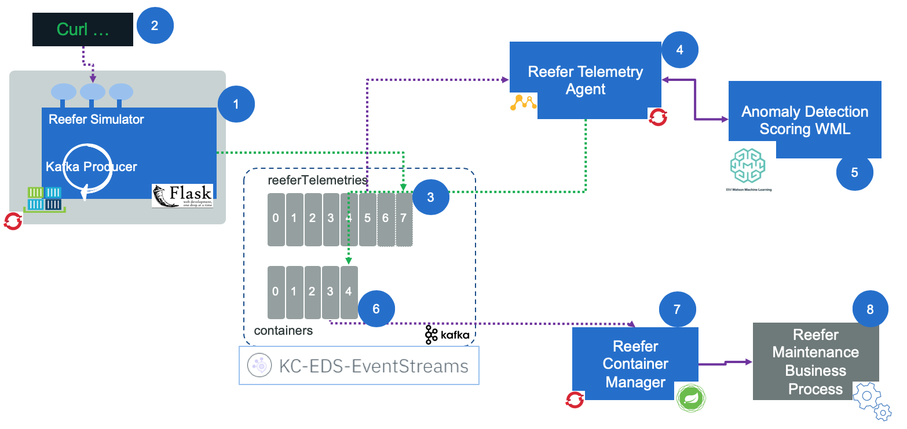
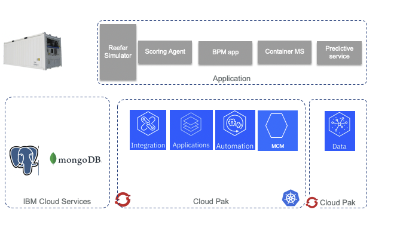
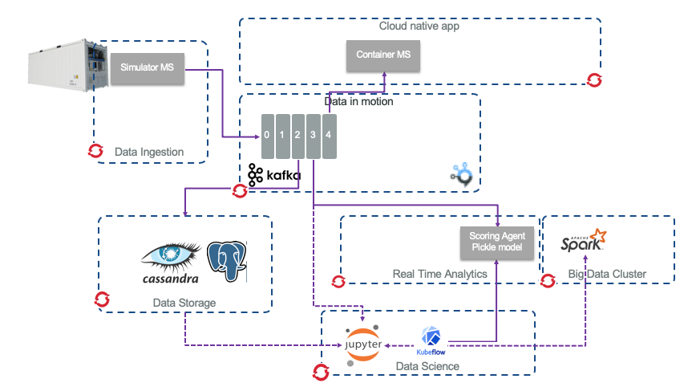

# Reefer Anomaly Detection Solution

This project aims to demonstrate how to perform real time analytics on data streams using an anomaly detection scoring service to assess Reefer container maintenance needs. Most of machine learning and analytics are done on data at rest using data warehouse and data lake technologies. In this repository we are presenting an approach to use both data at rest and in data in motion running in Kafka event backbone.

!!! note
    This project is part of the [reference implementation solution](https://ibm-cloud-architecture.github.io/refarch-kc/) to demonstrate the IBM [event driven reference architecture](https://ibm-cloud-architecture.github.io/refarch-eda) and represents one use case for the [IBM Data, AI and Analytics reference architecture](https://ibm-cloud-architecture.github.io/refarch-data-ai-analytics) but it also presents how to combine different IBM cloud paks to build the solution: Cloud pak for data,  Cloud pak for automation,  Cloud pak for integration and  Cloud pak for application.

The implementation is using two different approaches:

* one using open sources mostly from Apache projects
* one using IBM Cloud Pak products

As we will detail in [next section](#mvp-component-view), there are six components working together to run the end to end anomaly detection solution: a Reefer simulator (we do not have such Reefer containers in our stock yet), a Kafka cluser, a container microservice to manage reefer container, an analytics scoring agent combined with a deployed model as a service and a business process.


**Figure 1: The solution Components**

*The open source version integrate the model and the agent, so components 4 and 5 are integrated into the same process.*

## Problem statements

The Reefer container is an IoT device, which emits container telemetries every 3 minutes via the MQTT protocol.


**Figure 2: A Reefer or Refrigerator container as IoT**

We want to detect sensor anomaly and trigger a field engineer dispatch job to perform maintenance when the Reefer reaches an harbor. The Reefer container carries fresh product over seas. The telemetries are kept in the event backbone (kafka) for 20 days, an average vessel travel duration. And the telemetries are also persisted for longer time period in a document database (Cassandra or Mongo) or an object storage like [Ceph](https://docs.ceph.com/docs/master/).

Going into this content you will learn the following:

* how to apply anomaly detection on telemetry data using Waston Studio or Jupiter notebook and python library
* how to deploy the model as agent or web service using Watson ML or Kubeflow
* how to integrate kafka events into Pandas dataset for build test and training sets.
* how to develop microservice in python for scoring telemetry using [Appsody](https://appsody.dev/)
* how to use the different IBM cloud paks to develop and deploy the solution.

Some sensors may act badly. For example the co2 sensor telemetry plotted over time shows some sporadic behavior:


**Figure 3: A Co2 sensor acting strangely**

The goal is to identify in real time such behavior. When anomaly is detected, a new  event is posted to the `containers` Kafka topic so the Reefer container manager microservice can apply the expected business logic.

## A Cloud Pak Approach

To develop the solution we can use IBM Cloud Pak products as presented in the diagram below using a three layer architecture with Openshift for the deployment infrastructure.


**Figure 4: Cloud Paks and solution components**

We recommend to follow the [following tutorial](cp-approach.md) for understanding how the solution was built.

## An open source based solution


We also look at an open source version of this solution using an approach close to [opendatahub.io](http://opendatahub.io/) proposed architecture, as illustrated in the following diagram:


**Figure 5: Open source components and the solution components**

We are simplifying the Data ingestion layer, where normally the Reefer containers are sending telemetry via the MQTT protocol, so the data ingestion may leverage a product like [Apache Nifi](https://nifi.apache.org/) to transform the telemetry messages to kafka events. [Apache Kafka](https://kafka.apache.org/) is used as the event backbone and event sourcing so microservices, deployed on Openshift, can consume and publish messages.

For persistence reason, we may leverage big data type of storage like [Apache Cassandra](http://cassandra.apache.org/) or [mongodb](https://www.mongodb.com/) to persist the container's telemetries over a longer time period. This datasource is used by the Data Scientists to do its data preparation and build training and test sets and select the best model. We also illustrate how to connect to Kafka topic as data source, from a Jupyter notebook to also use data from Kafka to build training set and test set.

Data scientists can run Jupyter lab on OpenShift and build a model to be deployed as python microservice, consumer of Reefer telemetry events.

If you want to read more on how to build and run the solution with open source stack, see [this note](oos-approach.md).

### MVP component view

For a minimum viable demonstration the runtime components looks like in the figure below:


**Figure 6: The solution components**

1. A web app, deployed on Openshift, is running a simulator to simulate the generation of Reefer container telemetries while the container is at sea or during end to end transportation. The app exposes a simple POST operation with a control object to control the simulation. Here is an example of such [control.json](https://github.com/ibm-cloud-architecture/refarch-reefer-ml/blob/master/scripts/simulControl.json) object

    ```json
    { 'containerID': 'C02',
    'simulation': 'co2sensor',
    'nb_of_records': 1000,
    "product_id":  "P02"
    }
    ```

    The simulation can be done on o2sensor, co2sensor or power.

1. A curl script does the HTTP POST request of this json object. [See this paragraph.](#test-sending-a-simulation-control-to-the-post-api)
1. The telemetry events are sent to the `reefer-telemetry` topic in Kafka. They are defined as Avro schema.
1. The predictive scoring is a consumer of such events, read one event at a time and call the model internally, then sends a new event when maintenance is required. [See the note](analyze/oss-ml-dev.md) for details.
1. The maintenance requirement is an event in the `containers` topic.
1. The 6th component of the solution, is the [container microservice](https://ibm-cloud-architecture.github.io/refarch-kc-container-ms/) which was defined in the EDA reference implementation.
1. The [maintenance engineer intervention process](bpm/readme.md) is modeled in BPM, deploy on public cloud and the process application is exposed as API. The container identifier and the telemetry record is sent as input to the process.


## Project approach

The solution covers different development areas and practices:

* event driven microservice
* business process
* cloud native microservices
* DevOps
* data ops and machine learning model development.

The software life cycle integrate the three main tracks of DevOps, DataOps and MLOps as presented in [this methodology article](https://ibm-cloud-architecture.github.io/refarch-data-ai-analytics/methodology/).

### DevOps

As all the services developed in this solution are event-driven we do not need to rephrase how we used event storming and applied the different patterns for each microservices. You can read the following articles to learn more:

* [Event storming workshop](https://ibm-cloud-architecture.github.io/refarch-eda/methodology/eventstorming/)
* [From analysis to microservice using domain driven design](https://ibm-cloud-architecture.github.io/refarch-kc/design/readme/)
* [Apply DDD to order microservice](https://ibm-cloud-architecture.github.io/refarch-kc-order-ms/ddd-applied/)
* [Apply DDD to the container management microservice](https://ibm-cloud-architecture.github.io/refarch-kc-container-ms/ES2DDD2MS/)

For the adoption of Appsody and CI/CD based on tektron, we present how we use Cloud Pak for application in the development of the scoring microservice in [this note](infuse/dev-scoring.md).

To understand how to deploy each service on openshift see [this detailed note](infuse/build-run.md).

### DataOps

[Collect data with open source approach](collect/oss-collect-data.md).

[Collect data with cloud pak for data](collect/cp4d-collect-data.md).

### Model Ops

To use Jupyter, Sparks and kubeflow see [this note](analyze/oss-ml-dev.md)

## Further Readings

See the [compendium note](compendium.md)
