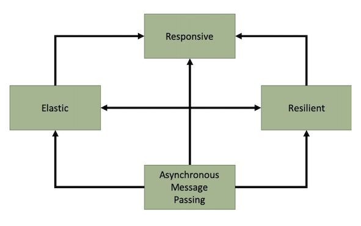
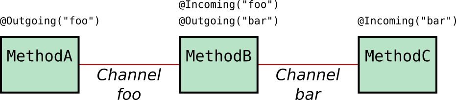

# Develop the scoring agent with Cloud Pak for Application

We have two approaches to build the predictive scoring agent:

1. One using a python Flask app listening to telemetry events coming from Kafka, run the predictive scoring within the same app. The model was developed with Jupiter notebook and serialized with [pickle](https://docs.python.org/3/library/pickle.html), so it responds in microseconds and generates anomaly to a second kafka topic. The code is under `scoring` folder, and uses essentially open source components. See [this article](oss-scoring-app.md) to understand how it is built.
1. One using Java MicroProfile 3.0 with the Reactive Messaging annotations, to consume telemetry events and call a remote predictive scoring service, developed and deployed within Cloud Pak for Data. The code is under `scoping-mp` folder.

The scoring service needs to use an analytics scoring model built using machine learning techniques, and serialized so that it can be loaded in memory.


## Java MicroProfile 3.0 with Cloud Pak for Application

In this version we, we would like to introduce the new MicroProfile Reactive Messaging feature that allows you to build Reactive Systems. But, what is a Reactive System?

### Reactive Systems

Reactive Systems provide an architecture style to deliver responsive systems. By infusing asynchronous messaging passing at the core of the system, applications enforcing the reactive system’s characteristics are inherently resilient and become more elastic by scaling up and down the number of message consumers.



Microservices as part of reactive systems interact using messages. The location and temporal decoupling, promoted by this interaction mechanism, enable numerous benefits such as:

- Better failure handling as the temporal decoupling enables message brokers to resend or reroute messages in the case of remote service failures.
- Improved elasticity as under fluctuating load the system can decide to scale up and down some of the microservices.
- The ability to introduce new features more easily as components are more loosely coupled by receiving and publishing messages.

The MicroProfile Reactive Messaging specification aims to deliver applications embracing the characteristics of reactive systems.

### Use Cases

MicroProfile Reactive Messaging aims to provide a way to connect event-driven microservices. The key characteristics of the specification make it versatile and suitable for building different types of architecture and applications.

First, asynchronous interactions with different services and resources can be implemented using Reactive Messaging. Typically, asynchronous database drivers can be used in conjunction with Reactive Messaging to read and write into a data store in a non-blocking and asynchronous manner.

When building microservices, the CQRS and event-sourcing patterns provide an answer to the data sharing between microservices. Reactive Messaging can also be used as the foundation to CQRS and Event-Sourcing mechanism, as these patterns embrace message-passing as core communication pattern.

IOT applications, dealing with events from various devices, and data streaming applications can also be implemented using Reactive Messaging. The application receives events or messages, process them, transform them, and may forward them to another microservices. It allows for more fluid architecture for building data-centric applications.

### MicroProfile Reactive Messaging

MicroProfile Reactive Messaging provides a very easy-to-use way to send, receive, and process messages and is well-suited to writing applications that process streams of events. With MicroProfile Reactive Messaging, you annotate application beans' methods and, under the covers, OpenLiberty (in our specific case) converts these to [reactive streams](http://www.reactive-streams.org/)-compatible publishers, subscribers and processors and connects them up to each other.



Although sending messages within our application is nice, it’s more useful to be able to send and receive messages from other systems. For this, MicroProfile Reactive Messaging also provides a Connector API to allow your methods to be connected to external messaging systems. Open Liberty includes the liberty-kafka connector for sending and receiving messages from an Apache Kafka broker.

It is important to understand that [MicroProfile Reactive Messaging](https://github.com/eclipse/microprofile-reactive-messaging) does not contain an implementation itself but only provides the specified API, a TCK and documentation. It is down to application server or external libraries to provide such implementation. For instance, [Open Liberty 19.0.0.9](https://openliberty.io/blog/2019/09/13/microprofile-reactive-messaging-19009.html) provides a full implementation of MicroProfile Reactive Messaging 1.0. OpenLiberty's implementation of the MicroProfile Reactive Messaging capabilities is based on [SmallRye Reactive Messaging](https://smallrye.io/smallrye-reactive-messaging/).

### Implement

Now that we have introduce what reactive systems are, what the use cases for these are and how the MicroProfile Reactive Messaging feature aims to help in constructing these, let's have a look at how we have implemented our scoring agent.

First of all, we have based our implementation on [MicroProfile](https://microprofile.io/) as the standardization for building microservices based applications. The application server we have chosen, that provides full MicroProfile support, is [OpenLiberty](https://openliberty.io/).

As already introduced, the scoring agent will react to a stream of data, in the form of messaging being sent from an IOT device in the Reefer Containers to Kafka (through an MQTT connector), which is used as our event backbone. The scoring agent will react to that stream of data being sent into a kafka topic through the MicroProfile Reactive Messaging feature that OpenLiberty implements and supports. It will do some computation for each of the messages coming as a stream of data, which in this case is to call the container anomaly predictive system, and send out a container anomaly message a to specific kafka topic where the Reefer Container EDA reference application listens to and will act in consequence. If you have not yet realise, this scenario fits into the IOT applications use case described in the earlier [section](#use-cases).

The main chunk of code that implements the scoring agent use case just described looks like this:

```Java
@Incoming("reeferTelemetry")
@Outgoing("containers")
@Acknowledgment(Acknowledgment.Strategy.MANUAL)
public PublisherBuilder<Message<String>> processTelemetry(Message<String> message) {

    // Get the message as String
    String input = message.getPayload();

    Gson g = new Gson();
    // Parsing the message into a TelemetryEvent Java Object
    TelemetryEvent te = g.fromJson(input, TelemetryEvent.class);
    // Getting the Telemetry out of the event.
    Telemetry t = new Telemetry(te.getPayload());

    // Calling the Anomaly Scoring service
    ScoringResult scoringResult = scoringClient.callAnomalyScoring(t);
    // Getting the Scoring Prediction Results
    ScoringPredictionValues result = scoringResult.getScoringPredictionValues();

    Boolean anomaly = result.getPrediction().equalsIgnoreCase("Issue");

    if (!anomaly){
        System.out.println("No container anomaly");
        message.ack(); // All processing of this message is done, ack it now
        return ReactiveStreams.empty();
    }
    else{
        System.out.println("A container anomaly has been predicted. Therefore, sending a ContainerAnomaly Event to the appropriate topic");
        ContainerAnomalyEvent cae = new ContainerAnomalyEvent(te.getContainerID(), te.getTimestamp(), t);
        System.out.println("ContainerAnomalyEvent object sent: " + cae.toString());

        // This message will be sent on, create a new message which acknowledges the incoming message when it is acked
        return ReactiveStreams.of(Message.of(cae.toString(), () -> message.ack()));
    }
}
```

where we are consuming/producing the data from/to Kafka by simply annotating our method with **@Incoming** and **@Outgoing** and leaving the rest of the magic required to create the reactive streams to the MicroProfile Reactive Messaging implementation of the OpenLiberty server does. Although there is certain magic in this process, there is still some configuration we need to provide OpenLiberty with in order for it to properly create the reactive streams.

Such configuration is provided in the [microprofile-configuration.properties](https://github.com/ibm-cloud-architecture/refarch-reefer-ml/blob/master/scoring-mp/src/main/resources/META-INF/microprofile-config.properties) file:

```properties
# Config specific to reeferTelemetry kafka topic
mp.messaging.incoming.reeferTelemetry.connector=liberty-kafka
mp.messaging.incoming.reeferTelemetry.group.id=reeferTelemetry-reactive
mp.messaging.incoming.reeferTelemetry.topic=reeferTelemetry
mp.messaging.incoming.reeferTelemetry.key.deserializer=org.apache.kafka.common.serialization.StringDeserializer
mp.messaging.incoming.reeferTelemetry.value.deserializer=org.apache.kafka.common.serialization.StringDeserializer

# Config specific to containers kafka topic
mp.messaging.outgoing.containers.connector=liberty-kafka
mp.messaging.outgoing.containers.group.id=containers-reactive
mp.messaging.outgoing.containers.topic=containers
mp.messaging.outgoing.containers.key.serializer=org.apache.kafka.common.serialization.StringSerializer
mp.messaging.outgoing.containers.value.serializer=org.apache.kafka.common.serialization.StringSerializer

#### Config shared between all kafka connections

# bootstrap server is the only config needed for plain insecure local kafka instance
mp.messaging.connector.liberty-kafka.bootstrap.servers=
```

where we can see the configuration for each of the incoming and outgoing reactive streams based on their names (reeferTelemetry and containers) that, in fact, match with the Kafka topics these reactive streams will be consuming/producing from/to. We also specify the serializer/deserializer we want MicroProfile Reactive Messaging to apply to our reactive streams for data processing but more importantly is the fact that we are telling OpenLiberty that the connector to be used is the **liberty-kafka** connector. Otherwise, OpenLiberty would not be able to interact with Kafka.

Finally, we are providing to the liberty-kafka connector the appropriate configuration for OpenLiberty to successfully connect and consume/produce data to Kafka. In the example above we are providing the Kafka bootstrap server but there are other properties that can be set here (such as security) that can be found in the [MicroProfile Reactive Messaging Specification](https://download.eclipse.org/microprofile/microprofile-reactive-messaging-1.0/microprofile-reactive-messaging-spec.html#_supported_method_signatures)

### Build

In order to be able to run our application, we first need to configure our OpenLiberty server to make use of the MicroProfile Reactive Messaging and MicroProfile Reactive Streams features it supports. Top do so, we specify such features in the [server.xml](https://github.com/ibm-cloud-architecture/refarch-reefer-ml/blob/master/scoring-mp/src/main/liberty/config/server.xml) file:

```xml
<server description="Liberty server">
    <featureManager>
        <feature>microProfile-3.0</feature>
        <!-- Reactive messaging and reactive streams -->
        <feature>mpReactiveMessaging-1.0</feature>
        <feature>mpReactiveStreams-1.0</feature>
    </featureManager>
    ...
</server>
```

Secondly, we need to configure our build process through the [pom.xml](https://github.com/ibm-cloud-architecture/refarch-reefer-ml/blob/master/scoring-mp/pom.xml) file (we are using Maven to build our application) to compile the code and build the resulting application with:

1. OpenLiberty as the target application server to run our application:

   ```xml
   <plugin>
       <groupId>net.wasdev.wlp.maven.plugins</groupId>
       <artifactId>liberty-maven-plugin</artifactId>
       <configuration>
           <assemblyArtifact>
               <groupId>${liberty.groupId}</groupId>
               <artifactId>${liberty.artifactId}</artifactId>
               <version>${version.openliberty-runtime}</version>
               <type>zip</type>
           </assemblyArtifact>
       </configuration>
   </plugin>
   ```

2. MicroProfile as the Java framework:

   ```xml
   <dependency>
       <groupId>org.eclipse.microprofile</groupId>
       <artifactId>microprofile</artifactId>
       <version>3.0</version>
       <type>pom</type>
       <scope>provided</scope>
   </dependency>
   ```

3. MicroProfile Reactive Messaging and MicroProfile Reactive Streams capabilities:

   ```xml
   <dependency>
       <groupId>org.eclipse.microprofile.reactive.messaging</groupId>
       <artifactId>microprofile-reactive-messaging-api</artifactId>
       <version>1.0</version>
       <scope>provided</scope>
   </dependency>
   <dependency>
       <groupId>org.eclipse.microprofile.reactive-streams-operators</groupId>
       <artifactId>microprofile-reactive-streams-operators-api</artifactId>
       <version>1.0.1</version>
       <scope>provided</scope>
   </dependency>
   ```

4. Apache Kafka Client:

   ```xml
   <dependency>
       <groupId>org.apache.kafka</groupId>
       <artifactId>kafka-clients</artifactId>
       <version>2.3.0</version>
   </dependency>
   ```

### Deploy

1. Create a Kubernetes Secret for the required `bootstrap.properties` file which will pass the Kafka configuration details to the Reactive Messaging components. These values are the same as other existing ConfigMaps and Secrets, however they cannot be used in the same manner due to the order that they are required to be in the system when Liberty starts up.
    - Download [bootstrap.properties.tmpl](https://github.com/ibm-cloud-architecture/refarch-reefer-ml/tree/master/scoring-mp/bootstrap.properties.tmpl)
    - Set `mp.messaging.connector.liberty-kafka.bootstrap.servers` to the comma-separated list of Kafka brokers. _(This is the same value as the `kafka-brokers` ConfigMap.)_
    - Update `mp.messaging.connector.liberty-kafka.sasl.jaas.config` to replace the `API-KEY` placeholder value with the Event Streams API key. _(This is the same value as the `eventstreams-apikey` Secret.)_
    - Create the Secret via the following command:
    ```shell
    kubectl create secret generic openliberty-bootstrap --from-file=bootstrap.properties=./bootstrap.properties.tmpl
    ```
2. Create a Kubernetes ConfigMap and Secret for the Cloud Pak For Data remote endpoints.
    - ConfigMap:
    ```shell
    kubectl create configmap predictive-model-configmap --from-literal=baseURL='https://zen-cpd-zen.demo.ibmcloudpack.com/' --from-literal=predictionURL='/v4/deployments/fb03738c-1234-abcd-wxyz-7e66106ee51c/predictions'
    ```
    - Secret:
    ```shell
    kubectl create secret generic predictive-model-secret --from-literal=user='replace-with-your-username' --from-literal=password='replace-with-your-password'
    ```
3. Create the necessary YAML files from the `scoring-mp` Helm Chart. A sample command is provided below:
```shell
helm template --output-dir . --set serviceAccountName=reefer-simulator --set route.enabled=true chart/scoringmp
kubectl apply -f ./scoringmp/template
```

### Run

Once we have our application running, we can confirm the following by looking at the application logs:

1. It is reacting to a data stream from the reeferTelemetries Kafka topic.
2. It is calling the container anomaly predictive system.
3. It is producing container anomaly events, when needed, into the containers Kafka topic.

```
[AUDIT   ] CWWKF0011I: The defaultServer server is ready to run a smarter planet. The defaultServer server started in 97.081 seconds.

Received message: {"containerID": "1111", "payload": "('1111', '2020-01-15 17:59:45', 'P05', 5.02702153, 5., 20.52035697, 2.62176459, 0, 1, 5, 21.56977522, 75.97754859, 39.85714797, 4.74727473, True, True, True, '37.8226902168957', '-122.324895', 0)", "timestamp": "2020-01-15 17:59:45", "type": "ReeferTelemetries"}

Getting Authentication token for the prediction service...
IAM service returned: 200

Payload for the prediction service call: {"input_data":[{"fields":["temperature","target_temperature","ambiant_temperature","kilowatts","time_door_open","defrost_cycle","oxygen_level","nitrogen_level","humidity_level","target_humidity_level","carbon_dioxide_level","fan_1","fan_2","fan_3"],"values":[[5.02702153,5.0,20.52035697,2.62176459,0.0,5,21.56977522,75.97754859,39.85714797,39.85714797,4.74727473,true,true,true]]}]}

This is the prediction: NoIssue
This is the probability: [0.0010803937911987305,0.9989196062088013]

No container anomaly

Received message: {"containerID": "1111", "payload": "('1111', '2020-01-15 17:59:45', 'P05', 5.02702153, 5., 20.52035697, 2.62176459, 0, 1, 5, 21.56977522, 75.97754859, 39.85714797, 4.74727473, True, True, True, '37.8226902168957', '-122.324895', 0)", "timestamp": "2020-01-15 17:59:45", "type": "ReeferTelemetries"}

Payload for the prediction service call: {"input_data":[{"fields":["temperature","target_temperature","ambiant_temperature","kilowatts","time_door_open","defrost_cycle","oxygen_level","nitrogen_level","humidity_level","target_humidity_level","carbon_dioxide_level","fan_1","fan_2","fan_3"],"values":[[5.02702153,5.0,20.52035697,2.62176459,0.0,5,21.56977522,75.97754859,39.85714797,39.85714797,4.74727473,true,true,true]]}]}

This is the prediction: Issue
This is the probability: [0.0010803937911987305,0.9989196062088013]

A container anomaly has been predicted. Therefore, sending a ContainerAnomaly Event to the appropriate topic

ContainerAnomalyEvent object sent: {containerID: 1111, timestamp: 1579111185000, type: ContainerAnomaly, payload: {temperature: 5.02702153, target_temperature: 5.0, ambiant_temperature: 20.52035697, kilowatts: 2.62176459, time_door_open: 0.0, content_type: 1, defrost_cycle: 5, oxygen_level: 21.56977522, nitrogen_level: 75.97754859, humidity_level: 39.85714797, carbon_dioxide_level: 4.74727473, fan_1: true, fan_2: true, fan_3: true, latitude: 37.8226902168957, longitude: -122.324895}}
```

## Deploying the model using Watson Machine Learning

TODO Cloud Pak model deployment

## Further Readings

* [Appsody for cloud native development](https://appsody.dev/)
* [Appsody microprofile stack](https://github.com/appsody/stacks/tree/master/incubator/java-microprofile)
* [Cloud Pak for Application demo video](https://www.youtube.com/watch?v=cKIkhhONBKM&t=46s)
* [Use Codewind for VScode](https://www.eclipse.org/codewind/mdt-vsc-getting-started.html)
* [Reactive messaging between microservices with MicroProfile on Open Liberty 19.0.0.9](https://openliberty.io/blog/2019/09/13/microprofile-reactive-messaging-19009.html)
* [Sending and receiving messages between microservices with MicroProfile Reactive Messaging](https://openliberty.io/blog/2019/09/13/microprofile-reactive-messaging.html)
* [MicroProfile Reactive Messaging Specification](https://download.eclipse.org/microprofile/microprofile-reactive-messaging-1.0/microprofile-reactive-messaging-spec.html)
* [Reactive Messaging for MicroProfile](https://github.com/eclipse/microprofile-reactive-messaging)
* [Reactive Streams](http://www.reactive-streams.org/)
