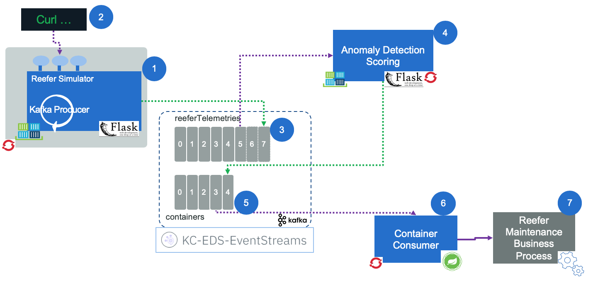

# Integration tests to proof the solution

Recall that the architecture of the deployed components look like in the figure below: 



So the first component to start is the container consumer which consumes events from the kafka `containers` topic. This topic is where the microservices will post messages about a Reefer container. It is used by this microservice already: [Reefer container manager](https://github.com/ibm-cloud-architecture/refarch-kc-container-ms/).

## Pre-requisites

Be sure to have set the environment variables in the `./scripts/setenv.sh` to point to your Event Stream or Kafka deployment.

You need to start four terminal windows if you run the solution locally on you laptop, and only 2 terminals if you run the solution on our deployed cluster.

!!! note
        Our deployed cluster in on IBM Cloud Openshift 3.11 cluster.


## Start Reefer container events consumer

In the `consumer` folder use the command:

```
./runContainerConsumer.sh
```

This script starts the docker python image, we built earlier and use the [ConsumeContainers.py](https://github.com/ibm-cloud-architecture/refarch-reefer-ml/blob/master/consumer/ConsumeContainers.py) module.


## Start the predictive scoring service

We can run it locally or on kubernetes cluster like Openshift. Under `scoring` folder, use the command:

```
./runScoringApp.sh
```
In the beginning of the trace log you should see the `bootstrap.servers` brokers list, the `group.id`, and api key as `sasl.password`.

Recalls the scoring is a producer and a consumer.

See the [build and run on Openshift section](https://ibm-cloud-architecture.github.io/refarch-reefer-ml/#scoring:-build-and-run-on-openshift) for running on kubernetes cluster.


## Start the simulator web app

Under the `simulator` folder 

```
./runReeferSimulator.sh
```

To build and run it on Openshift review [this section](#simulator:-build-and-run-on-openshift).

## Start a simulation

Under the `scripts` folder

```
./sendSimulControl.sh 
```

## Validate integration tests

To test your local deployment
```
./sendSimulControl.sh localhost:8080 poweroff
```

or to test on our cloud based deployed solution

```
./sendSimulControl.sh
```

The traces will look like these:

### Simulator trace

The trace from the pod demonstrate the configuration and the control message received at the POST operation, and then the event generated. 

```
{'bootstrap.servers': 'broker-3-"<hidden-part>.eventstreams.cloud.ibm.com:9093,broker-1-"<hidden-part>.eventstreams.cloud.ibm.com:9093,broker-0-"<hidden-part>.eventstreams.cloud.ibm.com:9093,broker-5-"<hidden-part>.eventstreams.cloud.ibm.com:9093,broker-2-"<hidden-part>.eventstreams.cloud.ibm.com:9093,broker-4-"<hidden-part>.eventstreams.cloud.ibm.com:9093', 'group.id': 'ReeferMetricsSimulator', 'security.protocol': 'sasl_ssl', 'sasl.mechanisms': 'PLAIN', 'ssl.ca.location': '/etc/pki/tls/cert.pem', 'sasl.username': 'token', 'sasl.password': '<hidden-part>'}

...

{'containerID': 'c101', 'simulation': 'poweroff', 'nb_of_records': 50, 'good_temperature': 4.4}
 Reefer contaimer metric event to send:{"containerID": "c101", "timestamp": 1566859800, "type": "ContainerMetric", "payload": "('2019-08-26 T22:50 Z', 'c101', 2.0905792037649547, 4.4, 16.282392569138707, 6.603341673152029, 2, 16, 8.827184272293419, 6.33603138958275, 0, 5)"}
Message delivered to containerMetrics [0]
 Reefer contaimer metric event to send:{"containerID": "c101", "timestamp": 1566859860, "type": "ContainerMetric", "payload": "('2019-08-26 T22:51 Z', 'c101', 2.0905792037649547, 4.4, 0, -0.04371530981778182, 2, 3, 6.295683442800409, 5.36863196753292, 0, 1)"}
Message delivered to containerMetrics [0]

...
```

### Scoring trace

```

```

### Container consumer trace

```
@@@ poll next container from containers partition: [0] at offset 3 with key b'c100':
	value: {"timestamp": 1566854815, "type": "ContainerMaintenance", "version": "1", "containerID": "c100", "payload": {"containerID": "c100", "type": "Reefer", "status": "MaintenanceNeeded", "Reason": "Predictive maintenance scoring found a risk of failure"}}
```