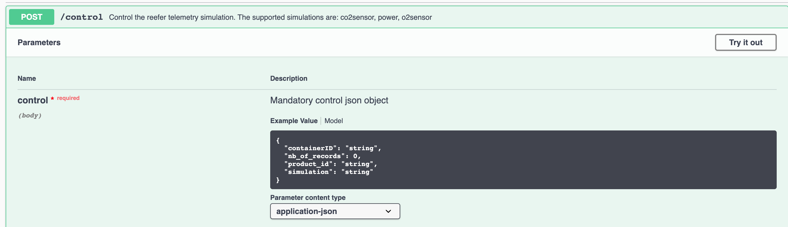
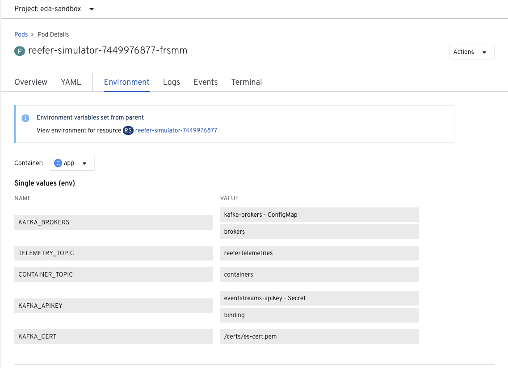

# The Simulator as web app

The Simulator webapp is a simple python (3.7) Flask web app exposing a REST POST end point to control the type of simulation to run and to produce Reefer telemetry events to kafka `reeferTelemetry` topic. 

!!! What_to_learn
    In this article we shortly present the design and implementation approaches used for this application, as well as how to use appsody to jumpstart the implementation, and continously run and debug the application. We are presenting some best practice on TDD with python.

## Requirements: Job Stories

The simulator is not in the critical path for production like component. It is here to help us develop the other components of the solution as we do not have real life Reefer container. To try something different, we are not using user stories to present what the simulator should do but we are using [job stories](https://jtbd.info/replacing-the-user-story-with-the-job-story-af7cdee10c27). 

1. when I want to generate mockup telemetries data for my data scientist friend, I want to start the simulator tool from command line so I can get a csv file with data
1. when I want to generate mockup telemetries data for my data scientist friend, I want to be able to simulate co2 sensor, o2 sensor and power sensor issue so I can get relevant data for the machine learning model to make sense
1. when I want to generate mockup telemetries data for my data scientist friend, I want to start the simulator tool from command line using parameter so I can get save data to a remote document oriented database: mongodb on IBM cloud. 
1. when I want to demonstrate the solution, I want to call a REST api to control the generation of faulty sensor data so I can get the scoring service returning maintenance needed.

The simulator needs to integrate with kafka / event stream deployed as service on the cloud or on-premise on openshift.

## Design approach

To support remote control of the simulator while running as webapp, we define a POST operation on the `/control` URL:



 with a json control object to define the number records to simulate, the sensor to impact (co2sensor, o2sensor, power) , the container ID, (one of C01, C02, C03, C04) which carries the product referenced by product_id (one of P01, P02, P03, P04, P05):

```json
    { 'containerID': 'C02',
    'simulation': 'co2sensor',
    'nb_of_records': 1000,
    "product_id":  "P02"
    }
```

We have tried to support a domain driven design approach to structure the code, with domain, infrastructure and app modules. The domain module has a unique class for the simulator which main goals is to generate tuples or records for the different simulation types. It is reused for the standalone simulation tools to generate data at rest.

As the simulator is also a webapp we need to package it with [Flask](https://www.fullstackpython.com/flask.html) and run it using one of the Web Server Gateway Interface (WSGI) implementation with [Gunicorn](http://docs.gunicorn.org/).

We recommend to follow [Flask tutorial](https://flask.palletsprojects.com/en/1.1.x/tutorial/) if you do not know this python library to develop web app or REST service.

Flask is a simple library to implement REST based microservice and web application in python. It has other related projects to add interesting features to develop production application. The standard development includes defining routes, function to support handling the request and generating HTTP response, but also defining APIs... Read more with the [explore Flask book online](http://exploreflask.com/en/latest/).
Flask is mono threaded so it fits well in a simple web application for development purpose, but for production it is recommended to add a web server like [Gunicorn](https://gunicorn.org/) to handle multiple concurrent requests.

## Code approach

The application is built using [Appsody](https://appsody.dev) as the developer experience tooling. The [Appsody CLI](https://appsody.dev/docs/getting-started/installation) is required locally to build and deploy the application properly.

The app is done using Flask, and the code is generated using `appsody init python-flask` command with the Python Flask appsody stack and template.  


Appsody helps developer to do not worry about the details of k8s deployment and build. During a Appsody run, debug or test step (2), Appsody creates a Docker container based on the parent stack Dockerfile, and combines application code with the source code in the template.

We recommend reading [the Python Flask Appsody Stack git hub repo](https://github.com/appsody/stacks/tree/master/incubator/python-flask) to get familiar with appsody python stack.

This stack is defining the Flask application, and import the 'userapp' where the application code resides, then use blueprints to define health and metrics APIs: 

```python
from flask import Flask

app = Flask(__name__)

from userapp import *

from server.routes.health import health_bp
app.register_blueprint(health_bp)
from server.routes.prometheus import metrics_bp
app.register_blueprint(metrics_bp)
```

This code is not updatable as it is part of the image. But we can add our business logic as part of the `simulator/__init__.py` code using another [Flask blueprints](https://flask.palletsprojects.com/en/1.1.x/blueprints/) module [api/controller.py]().

The `userapp` module is defined when appsody integrates our code with the stack base image using Docker. Below is an extract of the docker file managing module installation and defining what appsody does during build, run and test:

```
ENV APPSODY_MOUNTS=/:/project/userapp
ENV APPSODY_DEPS=/project/deps
WORKDIR /project
RUN python -m pip install -r requirements.txt -t /project/deps
ENV FLASK_APP=server/__init__.py
```

Looking at the content of the final docker container running the application we can see this structure:
```
/project
|-- Dockerfile  
    Pipfile  
    Pipfile.lock  
    constraints.txt  
    requirements.txt
    deps/    
    server/
    test/  
    userapp/
```

The basic concept of blueprints is that they record operations to execute when registered on an application. So to add the operation to support the control we add a blueprint, and then register it in the main application: `__init__py`.

```python
from userapp.api.controller import control_blueprint
app.register_blueprint(control_blueprint)
```

To define the API, we use [Flasgger](https://github.com/flasgger/flasgger) as an extension to Flask to extract [Open API specification](https://swagger.io/docs/specification/about/) from the code. It comes with Swagger UI, so we can see the API documentation of the microservice at the URL `/apidocs`.  It can also validate the data according to the schema defined. 

For the POST /control we define the using Swagger 2.0 the API in a separate file: `api/controlapi.yml` and import it at the method level to support the POSt operation. This method is defined in its blueprint as a REST resource. The code [controller.py](https://github.com/ibm-cloud-architecture/refarch-reefer-ml/blob/master/simulator/api/controller.py) is under `api` folder.

Below is a code extract to illustrate the use of Flask-RESTful and blueprint and the swagger annotation:

```python
from flasgger import swag_from
from flask_restful import Resource, Api

control_blueprint = Blueprint("control", __name__)
api = Api(control_blueprint)

class SimulationController(Resource):
    @swag_from('controlapi.yml')
    def post(self):
        # ..
api.add_resource(SimulationController, "/control")
```

The [Pipfile](https://github.com/ibm-cloud-architecture/refarch-reefer-ml/blob/master/simulator/Pipfile) defines the dependencies for this component, and is used by `pipenv` during the automatic build process within `appsody build`.

To launch the web application in development mode, using an IBM Event Streams remote use the following commands:

```shell
# set environment variables - from simulator folder
$ source ../scripts/setenv.sh OCP
# Start appsody with the environment variables: in simulator folder
$ appsody run --docker-options="-e KAFKA_BROKERS=$KAFKA_BROKERS -e KAFKA_APIKEY=$KAFKA_APIKEY -e KAFKA_CERT=$KAFKA_CERT -e TELEMETRY_TOPIC=$TELEMETRY_TOPIC -e CONTAINER_TOPIC=$CONTAINER_TOPIC"
```

The trace shows the Kafka configuration options:

```
Kafka options are:
[Container] {'bootstrap.servers': 'eventstream140-ibm-es-proxy-route-broker-0-eventstreams.apps.green.ocp.csplab.local:443', 'group.id': 'ReeferTelemetryProducers', 'security.protocol': 'SASL_SSL', 'sasl.mechanisms': 'PLAIN', 'sasl.username': 'token', 'sasl.password': 'xCByo4478xQH...EVdcbGNCtLLuItKgVDc', 'ssl.ca.location': '/project/userapp/certs/ocp/es-cert.pem'}
```

## Testing

### Unit test the Simulator

The test coverage is not yet great. To run the test use `appsody test`. 

```
cd simulator
./startPythonEnv
root@1de81b16f940:/# export PYTHONPATH=/home/simulator
root@1de81b16f940:/# cd /home/simulator
root@1de81b16f940:/# python tests/unit/TestSimulator.py 
```

### Functional testing


## Prepare for kubernetes deployment

1. There are three required configuration elements for connectivity to IBM Event Streams (Kafka) prior to deployment as we already presented in the following notes.

  * A `ConfigMap` named `kafka-brokers` **[Reference Link](https://ibm-cloud-architecture.github.io/refarch-kc/deployments/backing-services/#event-streams-kafka-brokers_1)**
  * A `Secret` named `eventstreams-api-key` **[Reference Link](https://ibm-cloud-architecture.github.io/refarch-kc/deployments/backing-services/#event-streams-api-key_1)**
  * A `Secret` named `eventstreams-cert-pem` _(if connecting to an on-premise version of IBM Event Streams)_ **[Reference Link](https://ibm-cloud-architecture.github.io/refarch-kc/deployments/backing-services/#event-streams-certificates)**

1. Once those elements are defined it is important to configure the app so it can retrieve those information via environment variables. With Appsody the file `appsody-config.yaml` is supporting these configurations. See the [lines 24 to 40](https://github.com/ibm-cloud-architecture/refarch-reefer-ml/blob/fa5001d89d70bd200c6aef5ee9cee3c5bf9b9fbc/simulator/app-deploy.yaml#L24) to get the settings to map environment variables to config maps or secrets. 

When using TSL connection, the TLS certificate is mounted inside the container via mounted file system. Inside the container the directory will be `/certs` and the volume is in fact a secret containing the pem certificate as string.

```yaml
volumeMounts:
  - mountPath: /certs
    name: eventstreams-cert-pem
  volumes:
  - name: eventstreams-cert-pem
    secret:
      optional: true
      secretName: eventstreams-cert-pem

```

## Build

The Docker image can be built from this directory by using the `appsody build` command:

1. Ensure you are logged in to the desired remote Docker registry through your local Docker client.
2. The `appsody build -t ibmcase/kcontainer-reefer-simulator:appsody-v1 --push` command will build and push the application's Docker image to the specified remote image registry (here this is the public docker hub repository).


## Application deployment

The application can be deployed to a remote OpenShift cluster by using the `appsody deploy` command (We recommend reading [Appsody build and deploy product documentation](https://appsody.dev/docs/using-appsody/building-and-deploying/)):

* Deploy using the docker image on public docker hub repository:

```shell
# login to the openshift cluster if not done already
oc login --token=rR.... --server=https://api.green.ocp.csplab.local:6443
# Deploy to the eda-sandbox project
appsody deploy -t ibmcase/kcontainer-reefer-simulator:appsody-v1 --namespace eda-sandbox --no-build
```

You can verify the deployment with the CLI 
```
oc get pods
```

or the via the Openshift console:



* To make the webapp visible externally to the cluster, you need to add a `route` for this deployment. Login to the admin console and use `Create Route` button on top right of the screen, 


Then enter a name and select the existing service


Once created, the URL of the app is visible in the route list panel:


Add the host name in your local /etc/hosts or be sure the hostname is defined in DNS server. Map to the IP address of the kubernetes proxy server end point.

### Continuous deployment with Tekton

The general approach to use Tekton to deploy the components of the solution is defined in [this note](../devops/cd.md).

## Usage

Once deployed, you can access the Swagger-based REST API via the defined route and trigger the simulation controls.

1. To determine the route, use the `oc get route reefer-simulator` command and go to the URL specified in the `HOST/PORT` field in your browser.
2. From there, drill down into the `POST /control` section and click **Try it out!**.
3. Enter any of the following options for the fields prepopulated in the `control` body:

    * Container: `C01, C02, C03, C04`
    * Product: `P01, P02, P03, P04`
    * Simulation: `poweroff, co2sensor, o2sensor, normal`
    * Number of records: A positive integer

4. Click **Execute**

### To generate data at rest

The same simulator can be run as a standalone tool to create csv files or to write to a remote mongoDB database. The explanation on how to use this tool is done in a [separate note here](../collect/generate-telemetry.md).

## More readings

* [Flask Restful](https://flask-restful.readthedocs.io/en/latest/quickstart.html)
* [Appsody build and deploy product documentation](https://appsody.dev/docs/using-appsody/building-and-deploying/)