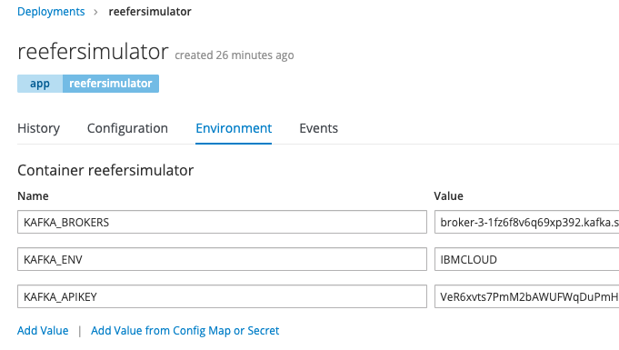
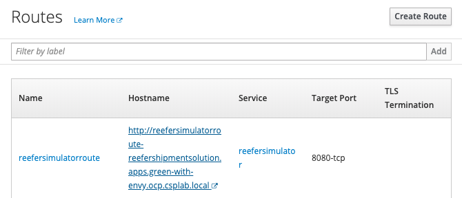

# The Simulator as web app

The Simulator webapp is a simple python (3.7) Flask web app exposing a REST POST end point to control the type of simulation and as effect it is producing Reefer telemetry events to kafka `reeferTelemetry` topic. 
The POST operation in on the `/control` url and send a jsong control object, like:

```json
    { 'containerID': 'C02',
    'simulation': 'co2sensor',
    'nb_of_records': 1000,
    "product_id":  "P02"
    }
```

## Design approach

We have tried to support a domain driven design approach to structure the code, with domain, infrastructure and app modules. The domain module has a unique class for the simulator which main goals is to generate tuples or records for the different simulation types. It is reused for the standalone simulation tools to generate data at rest.

As the simulator is also a webapp we need to package it with [Flask](https://www.fullstackpython.com/flask.html) and run it using one of the Web Server Gateway Interface (WSGI) implementation with [Gunicorn](http://docs.gunicorn.org/).

We recommend to follow [Flask tutorial](https://flask.palletsprojects.com/en/1.1.x/tutorial/) if you do not know this python library to develop web app or REST service.

Flask is a simple library to implement REST based microservice and web application in python. It has other related projects to add interesting features to develop production application. The standard development includes defining routes, function to support handling the request and generating HTTP response, but also defining APIs... Read more with the [explore Flask book online](http://exploreflask.com/en/latest/).
Flask is mono threaded so it fits well in a simple web application for development purpose, but for production it is recommended to add a web server like [Gunicorn](https://gunicorn.org/) to handle multiple concurrent requests.

- explain swaggers
- explain blueprint

The pipfile defines the dependencies for this component. 


## Testing

### Unit test the Simulator

The test coverage is not yet great. To run them

```
cd simulator
./startPythonEnv
root@1de81b16f940:/# export PYTHONPATH=/home/simulator
root@1de81b16f940:/# cd /home/simulator
root@1de81b16f940:/# python tests/unit/TestSimulator.py 
```

## Build

We have multiple build approaches depending of the environment: local, openshift source to image, github actions.

### Build locally with docker

The goal is to build the docker image, publish it to docker hub registry or a private registry, which then can be deployed to any kubernetes environment or run using docker compose:

```shell
# In simulator folder
docker build -t ibmcase/kcontainer-reefer-simulator .
docker login
docker push ibmcase/kcontainer-reefer-simulator
> The push refers to repository [docker.io/ibmcase/kcontainer-reefer-simulator]
```

The scripts: `scripts/runReeferSimulatorApp.sh IBMCLOUD` should run the simulator docker image with Event Streams on IBM Cloud.

### Openshift  source to image

To build and deploy the code to an OpenShift cluster, using the source 2 image approach, do the following steps:

1. Login to the OpenShift cluster. 

    ```
    oc login -u apikey -p <apikey> --server=https://...
    ```

    *To find the API key and server URL go to the openshift console under your account, to access the `Copy login command` menu.* 

1. Create a project if you did not create one already:

    ```
    oc  new-project reefershipmentsolution --description="A Reefer container shipment solution"
    ```

    *Remember the project is mapped to a kubernetes namespace, but includes other components too*

1. The first deploy you need to create a new app from the source code, and use source to image build process to deploy the app. You can use a subdirectory of your source code repository by specifying a --context-dir flag.

    ```
    oc new-app python:latest~https://github.com/ibm-cloud-architecture/refarch-reefer-ml.git --context-dir=simulator --name reefersimulator
    ```

    Then to track the build progress, look at the logs of the build pod:
    
    ```
    oc logs -f bc/reefersimulator
    ```
    The dependencies are loaded, the build is scheduled and executed, the image is uploaded to the registry, and started.

1. To display information about the build configuration for the application:

    ```
    oc describe bc/reefersimulator
    ```

1. When you want to redeploy, trigger a remote build (run on Openshift) from local source code do the following command:

    ```
    oc start-build reefersimulator --from-file=.
    ```

1. Set environment variables

    For Broker URLs
    ```
    oc set env dc/reefersimulator KAFKA_BROKERS=kafka03-prod02.messagehub.services.us-south.blu....
    ```

    For apikey:
    ```
    oc set env dc/reefersimulator KAFKA_APIKEY=""
    ```

    If you connect to event stream or kafka with SSL specify where to find the SSL certificate: 

    ```
     oc set env dc/reefersimulator KAFKA_CERT="/opt/app-root/src/es-cert.pem"
    ```

    Get all environment variables set for a given pod: (get the pod id with `oc get pod`)

    ```
    oc exec reefersimulator-31-2kdv5 env
    ```

    

1. Once the build is done you should see the container up and running

    ```
    oc get pod

    reefersimulator-3-build         0/1       Completed    0          15m
    reefersimulator-3-jdh2v         1/1       Running      0          1m
    ```

    !!! note
            The first time the container start, it may crash as the environment variables like KAFKA_APIKEY is not defined. You can use the  `./scripts/defEnvVarInOpenShift.sh` command to create the needed environment variables.

1. To make the webapp visible externally to the cluster, you need to add a `route` for this deployment. Login to the admin console and use `Create Route` button on top right of the screen, 


Then enter a name and select the existing service


Once created, the URL of the app is visible in the route list panel:



Add the host name in your local /etc/hosts or be sure the hostname is defined in DNS server. Map to the IP address of the kubernetes proxy server end point.