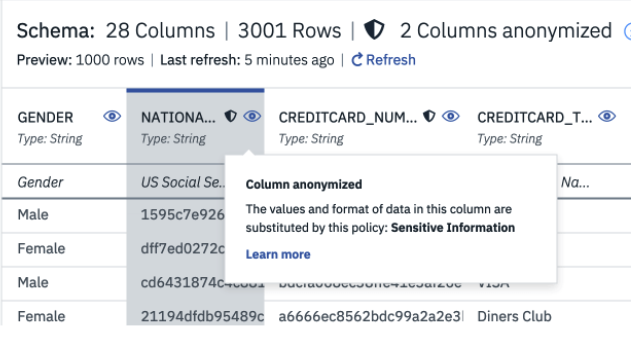

# Organize data

Under Construction

## Watson Knowledge Catalog

Starting the data governance with IBM [Watson® Knowledge Catalog](https://www.ibm.com/cloud/watson-knowledge-catalog) to help Data scientists and data stewards to find, prepare and understand the data they need.

With the Catalog you can define business terms, add data governance rules to enforce protection to data assets: deny, redact, subsitute or mask columns. Then you can see the relationships between a term and assets, policies using it.

The figure below illustrates the anonymized column containing sensitive information, by using policies, substitution rules and business terms.

For more detail on how to build those rule see [this product tour](https://www.ibm.com/cloud/garage/dte/producttour/ibm-watson-knowledge-catalog-guided-demo-explore-active-policy-management).

