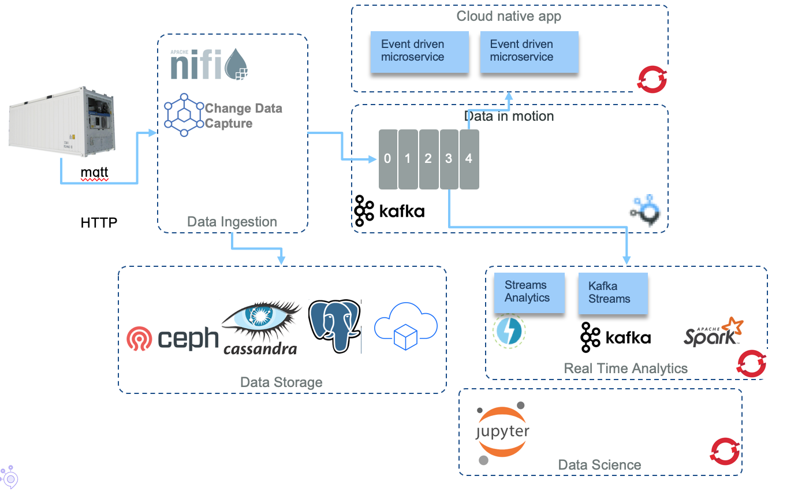
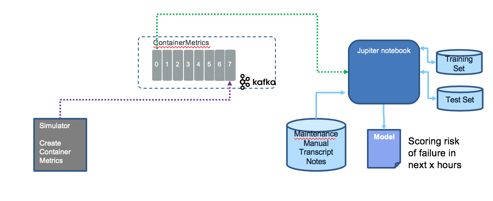

# Reefer Container Predictive Maintenance

In this section, we discuss how to build an analytic model using machine learning techniques from data coming from event store like kafka. We train the model with the help of historical data to predict whether maintenance is required for the reefer container at a certain point in time.

You will learn how to simulate date for reefer, develop the predictive maintenance model, and integrate the model into an application.

## Introduction

A reefer container is a refrigerated shipping container used to store or transport frozen or cold goods perishable items or goods that require temperature control. 


Reefers make an excellent, portable solution for short or long term storage and can be used to ship or truck goods over long distances as they can be plugged into the power station on ships or have it clipped on generators attached.

Perishable products must be kept at a controlled temperature, from point of origin to delivery to retailer or pharmacy. The logistics industry refers to this as the “cold chain” and it encompasses both “reefers” (refrigerated containers) as well as warehouses, distribution centers and the final storage or holding areas.

Throughout this chain the risk of failure is ever-present, meaning there is always a possibility of cargo exceeding permissible or safe temperature levels, even if only briefly. For example, a truck might be stopped without power in desert heat, allowing temperatures in the reefer to rise. Then power is restored and the temperature in the container comes back down, but the product is damaged.

When cargo with such as any of those items listed above are exposed to temperatures outside of prescribed limits it can be damaged. In some cases this is evident, such as with bananas, but in other situations, like the transport of vaccines, it may not be apparent that damage has occurred and the vaccine becomes ineffective. For some products, going over temperature, even only briefly, can reduce shelf life dramatically, incurring substantial costs when it cannot be sold. 

Organizations contracting to ship perishable products often specify the permissible temperature range. However, even if it is possible to show that product was exposed to conditions outside of those contracted, proving where it happened, and thus responsibility, can be much harder.

## Predictive maintenance problem statement

The success of predictive maintenance models depend on three main components: 

* having the right data
* framing the problem appropriately 
* evaluating the predictions properly

From a methodology point of view the Data Scientist needs to address the following questions:

* What type of failure to consider and which one to predict?
* What kind of failure is happening? slow degradation or instantaneous failure?
* What could be the relation between a product characteristics and the failure?
* What kind of measure exist to assess the given characteristic?
* Which measurements correspond to good functioning and which ones correspond to failure?
* How often metrics are reported?
* What question the model should answer?
* What kind of output should the model give?
* How long in advance should the model be able to indicate that a failure will occur?
* What are the business impact to do not predict the failure? and predicting false negative failure?
* What is the expected accuracy?  

### Reefer problem types

There are multiple different potential issues that could happen to a refrigerator container. We are choosing to model the "Sensor Malfunctions" issue: Sensors in the refrigeration unit need to be calibrated and be continuously operational. An example of failure may come from the air sensor making inaccurate readings of temperatures, which leads to sploiled content. A potential reason may come from a faulty calibration, which can go unnoticed for a good time period. It may be difficult to know if there is an issue or not. 

The other common potential issues are:

* Fluid leaks, like engine oil, coolant liquid. The preassure sensors added to the circuit may help identify preassure lost over time.
* Faulty belts and hoses.
* Faulty calibration: A non-calibrated reefer can cool at a slower or faster rate than desired.
* Damaged Air Chute.
* Condenser Issues like broken or damaged coils, clamps or bolts missing, and leaks.
* Door Seals damaged. 
* Blocked air passage: to keep the temperature homogenous inside the reefer.

So the question we want to answer is: does the Reefer keep accurate temperature overtime between what is set versus what is measured?

## Architecture

The target production architecture is based on the data and AI reference architecture, adapted for real time analytics. It is very close to what [Open Data Hub](https://opendatahub.io/) architecture looks like.



The Reefer container,a as IoT device emits container metrics avery minutes via the MQTT protocol. The first component receiving those messages is Apache Nifi to transform the message to a kafka events. Kafka is used as the event backbone and event sourcin so microservices, deployed on openshift, can consume and publish messages. 

For persistence reason, we may leverage big data type of storage like Cassandra to persist the container metrics over a longer time period. This datasource is used for the Data Scientists to do its data preparation and build training and test sets. 

Data scientists can run Jupyter lab on OpenShift and build a model to be deployed as python microservice, consumer of kafka events. The action will be to trigger an email for the Reefer container to be put in maintenance.

## Data set

Well we do not have real Reefer data. But we may be able to simulate them. As this is not production work, we should be able to get the end to end story still working from a solution point of view.

The historical data need to represent failure, and represent the characteristics of a Reefer container. We can imagine it includes a lot of sensors to get interesting correlated or independant features.

We have implemented a simulator to create those metrics to be used to build the model inside Jupiter notebook and with sklearn or tensorflow library. 

The simulator will be also used as an event producer to send real time events to kafka, as if the Reefer container was loaded with fresh goods and is travelling oversea. A consumer code can call the predictive model to assess if maintenance is required and post new event on a containermaintance topic.

Here is a diagram for the data scientist environment:



For the runtime execution we will plug the model as a consumer of `containerMetrics` topic which keeps container metrics in the form of event like below, keyed by containerID.

```json
{
    "timestamp": 1234567,
    "containerID": "C10",
    
}
```


 The code is under the `tools` folder. The simulator can create two types of data: poweroff or co2 

### 1. Poweroff

When the reefer containers lose power at some time, the temperature within the container starts raising. To generate data for this scenario, start the python environment using our docker image and the script - startPythonEnv

```
 ./startPythonEnv 
```

you will be in a bash within the container with the local `tools` folder mounted under the `/home` folder.

The simulator accepts different arguments: 

```
sage reefer_simulator --stype [poweroff | co2sensor | atsea]
	 --cid <container ID>
	 --records <the number of records to generate>
	 --temp <expected temperature for the goods>
	 --file <the filename to create (without .csv)>
	 --append [yes | no]  (reuse the data file)
```

```
root@03721594782f: cd home
root@03721594782f: python reefer_simulator.py --stype poweroff --cid 101 --records 1000 -temp 4 --file testdata --append yes

Generating  1000  poweroff metrics
Timestamp   ID  Temperature(celsius) Target_Temperature(celsius)      Power  PowerConsumption ContentType  O2 CO2  Time_Door_Open Maintenance_Required Defrost_Cycle
1.000000  2019-06-30 T15:43 Z  101              3.416766                           4  17.698034          6.662044           1  11   1        8.735273                    0             6
1.001001  2019-06-30 T15:43 Z  101              4.973630                           4   3.701072          8.457314           1  13   3        5.699655                    0             6
1.002002  2019-06-30 T15:43 Z  101              1.299275                           4   7.629094          7.174810           1  15   1        7.146702                    0             6
1.003003  2019-06-30 T15:43 Z  101              5.371080                           4   5.857190          6.542220           1   0   3        4.305004                    0             6
1.004004  2019-06-30 T15:43 Z  101              5.371080                           4   0.000000          7.145957           1   0   0        8.305748                    0             6
1.005005  2019-06-30 T15:43 Z  101              6.971080                           4   0.000000          6.438677           1   1   0        6.495389                    0             6
1.
```

### 2. Co2 sensor malfunction

In the same way as above the simulator can generate data for Co2 sensor malfunction, using the below command,
```
python reefer_simulator.py co2sensor 101 1000 4 testdata no
```

To build the data set we are using the following approaches:

1. When the door of the reefer container is open

    We are using exponential distribution here to generate data which varies at a very fast rate.

2. When there is a sensor malfunction (or sensors are incorrectly calibrated)

    We are using random gaussian distribution here to generate data with arbitrary variations

3. When the reefer container is functioning as expected (baseline/groundtruth for our model)

    We are using uniform distribution here to generate expected data.

The features we are creating are:
```
=====================
Timestamp, ID, Temperature(celsius), Target_Temperature(celsius), Amp, CumulativePowerConsumption, ContentType, Humidity, CO2, Door_Open, Maintainence_Required, Defrost_Cycle
=====================
```

## Modeling techniques

The model uses the generated data from above scenarios: 

1. When the container's door is open for a longer time - this gives a false positive that maintainence is required.
1. When sensors are malfunctioning, it records arbitrary readings.
1. When the readings are normal. We have currently trained our model on 3000 datapoints from the three scenarios above. 

There are different modeling approach to tackle predictive maintenance:

* regression model
* classification to predict failure for a given time period
* classify anomalous behavior: classes are not known in advance. Normal operation is known.
* compute probability of failure over time

### Code execution

The simulator continuosly generates container metrics, publishes it to Kafka and run the predictMaintainence.ipynb to predict if maintainence is sought at this point in time. 


## Model description

We are using Machine Learning supervised learning here. There are two types of supervised learning - 1) Classification: Predict a categorical response, 2) Regression: Predict a continuous response

### Linear regression

Pros: 1) Fast 2) No tuning required 3) Highly interpretable 4) Well-understood

Cons: 1) Unlikely to produce the best predictive accuracy 2) Presumes a linear relationship between the features and response 3) If the relationship is highly non-linear as with many scenarios, linear relationship will not effectively model the relationship and its prediction would not be accurate

### Naive Bayes classification

Naive Bayes is a probabilistic classifier inspired by the Bayes theorem under a simple assumption which is the attributes are conditionally independent.

The classification is conducted by deriving the maximum posterior which is the maximal P(Ci|X) with the above assumption applying to Bayes theorem. This assumption greatly reduces the computational cost by only counting the class distribution. Even though the assumption is not valid in most cases since the attributes are dependent, surprisingly Naive Bayes has able to perform impressively.

Naive Bayes is a very simple algorithm to implement and good results have obtained in most cases. It can be easily scalable to larger datasets since it takes linear time, rather than by expensive iterative approximation as used for many other types of classifiers.

Naive Bayes can suffer from a problem called the zero probability problem. When the conditional probability is zero for a particular attribute, it fails to give a valid prediction. This needs to be fixed explicitly using a Laplacian estimator.


## Model evaluation

We are using Root Mean Squared Error (RMSE) for evaluating the model performance.

Root Mean Squared Error (RMSE) is the square root of the mean of the squared errors.

Classification does better here as the scenarion is more of a classification problem.

## References


* [Understand Reefer container](https://cargostore.com/blog/what-are-reefer-containers/)
* For modeling predictive maintenance we found [this article](https://medium.com/bigdatarepublic/machine-learning-for-predictive-maintenance-where-to-start-5f3b7586acfb) from BigData Republique, on Medium, very interesting. 
* [PREDICTION OF TEMPERATURE INSIDE A REFRIGERATED CONTAINER IN THE PRESENCE OF PERISHABLE GOODS](http://www.sfb637.uni-bremen.de/pubdb/repository/SFB637-B6-10-011-IC.pdf)
* [Temperature Monitoring During Transportation, Storage and Processing of Perishable Products](https://www.omega.com/technical-learning/temperature-monitoring-during-transportation.html)

* [Understanding machine learning classifiers](https://towardsdatascience.com/machine-learning-classifiers-a5cc4e1b0623)